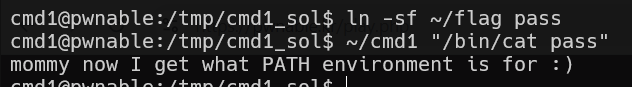

# cmd1 Solution

here we need to read the flag, but can't use some strings, as `sh` `flag` and `tmp`

so, first we'll enter our tempdir, then create link to flag `ln -sf ~/flag pass`, and lastly execute the cmd1: `~/cmd1 "/bin/cat pass"`

**Flag:** ***`mommy now I get what PATH environment is for :)`***
