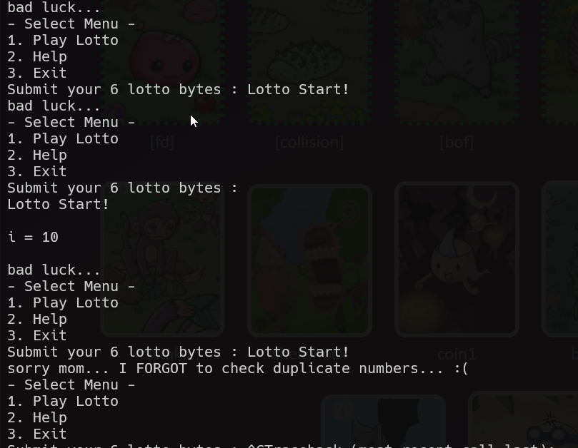

# lotto Solution

in this challenge the lotto process isn't so good, it uses double for-loop and this reduce our brute force to only 45 options.

i used this script [lotto.py](./scripts/lotto/lotto.py)

**Flag:** ***`sorry mom... I FORGOT to check duplicate numbers... :(`***
