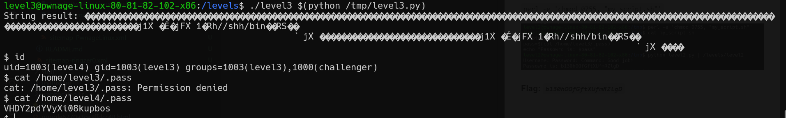

# Level3 Pwnage Linux Level Up Solution

It doesn't put NULL after the strncat, so, we can manipulate it to make buffer overflow and then override the ret-address.
This is our script: [level3.py](./scripts/level3/level3.py)

**Flag:** ***`VHDY2pdYVyXi08kupbos`***
