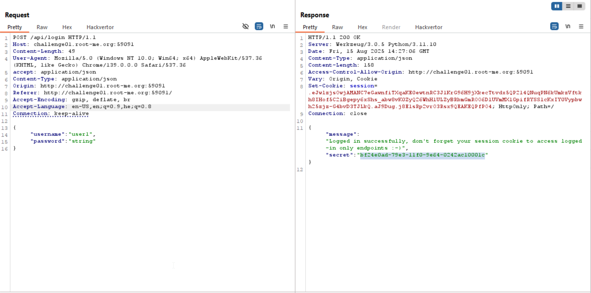
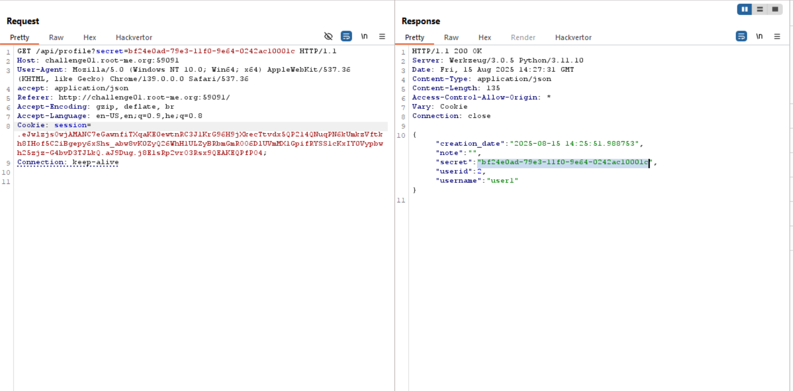
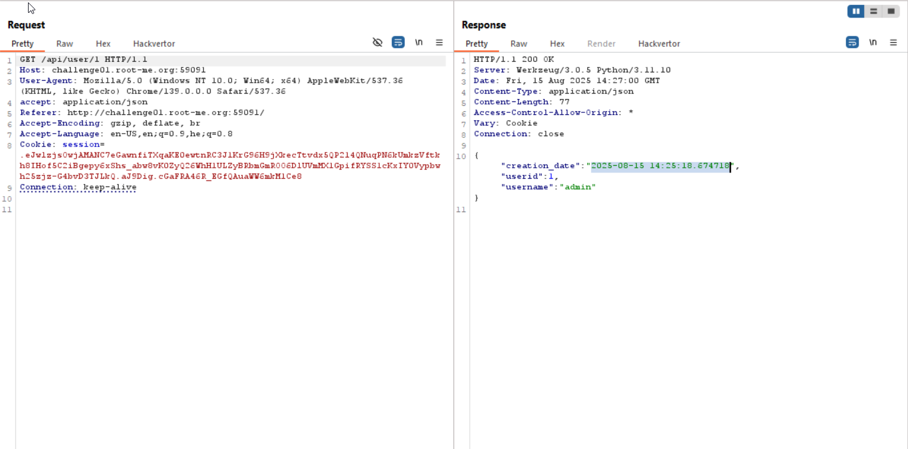
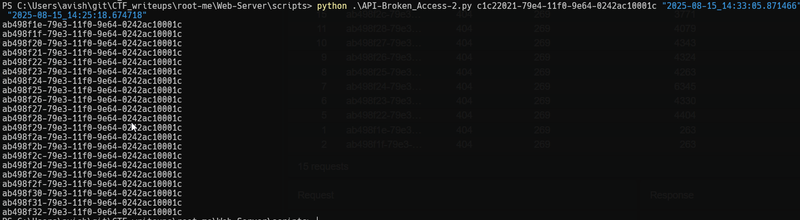
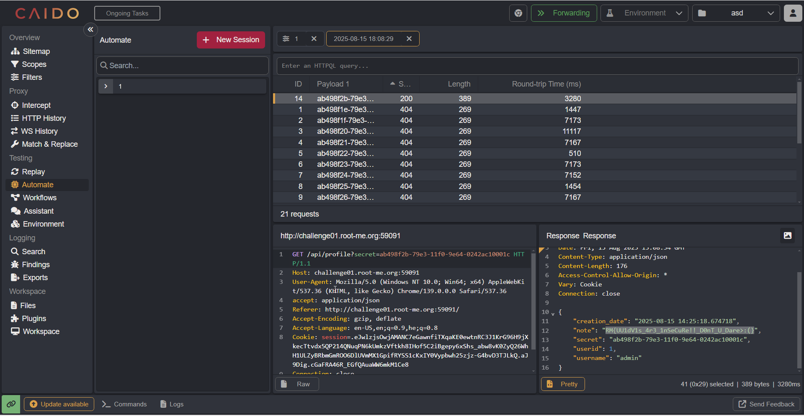

In this challenge, we exploit the fact it uses UUIDv1, and we can regenerate the secret of the admin.

First, we `signup` and then `login`, when log using the credentials we get `secret`, which can be send in `profile` to achieve info.

Here you can see the `login`:


And here the retrieve of `profile` using the secret: `bf24e0ad-79e3-11f0-9e64-0242ac10001c`


As you can see, we get back:
```json
{
    "creation_date":"2025-08-15 14:25:51.988753",
    "note":"",
    "secret":"bf24e0ad-79e3-11f0-9e64-0242ac10001c",
    "userid":2,
    "username":"user1"
}
```

Then, we go to the endpoint `/api/user` and supply `userid=1`, like this: `/api/user/1`, and then achieve info about the admin.



We can see it was created in `2025-08-15 14:25:18.674718`.

Next, we create another user, get this json:
```json
{
    "creation_date":"2025-08-15 14:33:05.871466",
    "note":"",
    "secret":"c1c22021-79e4-11f0-9e64-0242ac10001c",
    "userid":3,
    "username":"user2"
}
```
Very interesting, the secrets looks very similar...
```
bf24e0ad-79e3-11f0-9e64-0242ac10001c
c1c22021-79e4-11f0-9e64-0242ac10001c
```

Then, I've found this article [Why UUIDv1 shouldn't be used to generate security tokens](https://medium.com/@iason.tzortzis/why-uuidv1-should-not-be-used-to-generate-security-tokens-explained-22f8867ea695), okay, that's sounds interesting.

We can detect it's UUIDv1 by the first `1` in here: `11f0`.

In general, UUIDv1 token is 128 bit which is consist of 4 main things:
* 60 bits - timestamp of 100-nanosecond intervals since *00:00:00, October 15, 1582, which is the Gregorian calendar start*.
* 14 bits - Clock sequence, to avoid duplicates if the clock goes backward
* 48 bits - usually the MAC address of the machine, in our case probably the container id because the challenges are running inside docker container.
* 6 bits - version and variant

For example, in our case:
```
bf24e0ad-79e3-11f0-9e64-0242ac10001c
```
| Field                             | Value (hex)    | Bits                                    |
| --------------------------------- | -------------- | --------------------------------------- |
| **time_low**                     | `bf24e0ad`     | 32                                      |
| **time\_mid**                     | `79e3`         | 16                                      |
| **time\_hi\_and\_version**        | `11f0`         | 16 (12 bits timestamp + 4 bits version) |
| **clock\_seq\_hi\_and\_reserved** | `9e`           | 8                                       |
| **clock\_seq\_low**               | `64`           | 8                                       |
| **node**                          | `0242ac10001c` | 48                                      |

As we can see, the only part that's changed is time_low. 
We Also know where the admin security token was created, in `2025-08-15 14:25:18.674718`.

So, we can regenerate the admin token using this script.
```py

```

This script gets as arguments the token we created and its time, and also the time of the admin token:
```
Usage: python generate_uuid.py <ref_token> <ref_time> <target_time>
```


It gives us list of possible tokens:
```
ab498f1e-79e3-11f0-9e64-0242ac10001c
ab498f1f-79e3-11f0-9e64-0242ac10001c
ab498f20-79e3-11f0-9e64-0242ac10001c
ab498f21-79e3-11f0-9e64-0242ac10001c
ab498f22-79e3-11f0-9e64-0242ac10001c
ab498f23-79e3-11f0-9e64-0242ac10001c
ab498f24-79e3-11f0-9e64-0242ac10001c
ab498f25-79e3-11f0-9e64-0242ac10001c
ab498f26-79e3-11f0-9e64-0242ac10001c
ab498f27-79e3-11f0-9e64-0242ac10001c
ab498f28-79e3-11f0-9e64-0242ac10001c
ab498f29-79e3-11f0-9e64-0242ac10001c
ab498f2a-79e3-11f0-9e64-0242ac10001c
ab498f2b-79e3-11f0-9e64-0242ac10001c
ab498f2c-79e3-11f0-9e64-0242ac10001c
ab498f2d-79e3-11f0-9e64-0242ac10001c
ab498f2e-79e3-11f0-9e64-0242ac10001c
ab498f2f-79e3-11f0-9e64-0242ac10001c
ab498f30-79e3-11f0-9e64-0242ac10001c
ab498f31-79e3-11f0-9e64-0242ac10001c
ab498f32-79e3-11f0-9e64-0242ac10001c
```

We drop it into Intruder in `Caido`, Because I have the community edition in Burp, and Intruder in Burp is annoying.

In `Caido` you can use intruder easily, no annoying delays.



**Flag:** ***`RM{UU1dV1s_4r3_1nSeCuRe!!_D0nT_U_Dare>:(}`***
