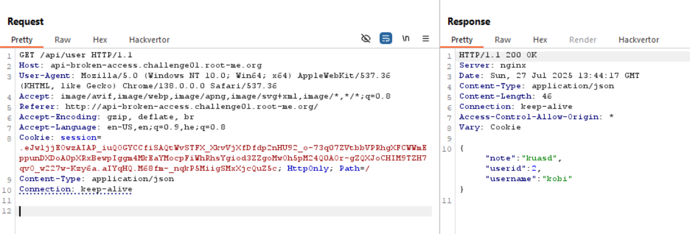
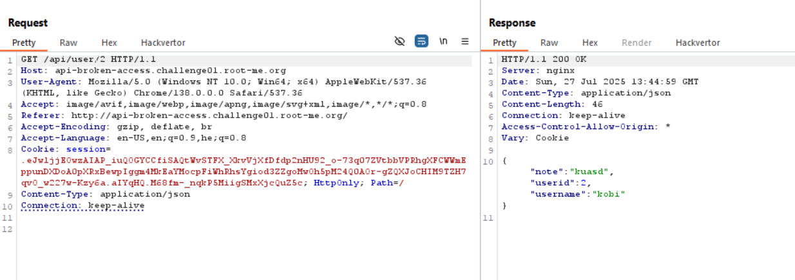

First, it was a bit complicated to access this level, i was needed to disable my chrome persistence to follow the `HSTS` header.

So, i entered here `chrome://net-internals/#hsts` and told him to not obligate the `HTTPS` on this `api-broken-access.challenge01.root-me.org` specific domain.

Then, I created a user and played a bit with the endpoints.
I used this request, to retrieve content: 

I saw it's possible to get the user_id as a path,

And then, I tried to get user_id `1`, using IDOR, and it worked

**Flag:** ***`RM{E4sy_1d0r_0n_API}`***
