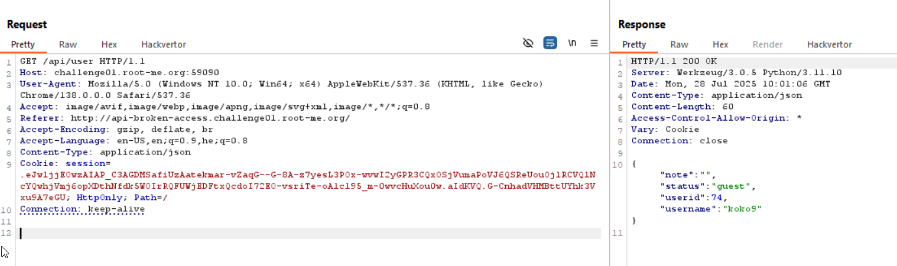
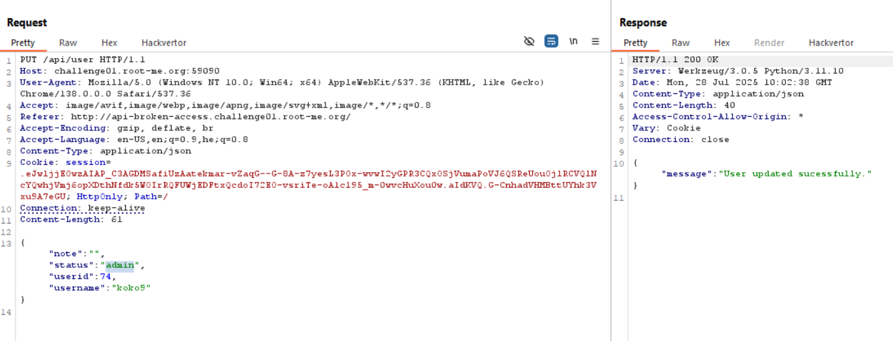
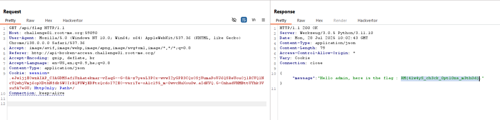

Here, we again create the user and retrive the data.

Then, we get the user data via this endpoint.

Let's try and change our data by changing the method from `GET` to `PUT`, and giving the json with status `admin`

Here we can see the `API-Mass-Assignment`, that we can set our user data, if we use different http method.
Notice you might need to add this header `Content-Type: application/json` if not exist.

And then, we can get the flag.

**Flag:** ***`RM{4lw4yS_ch3ck_0pt10ns_m3th0d}`***
