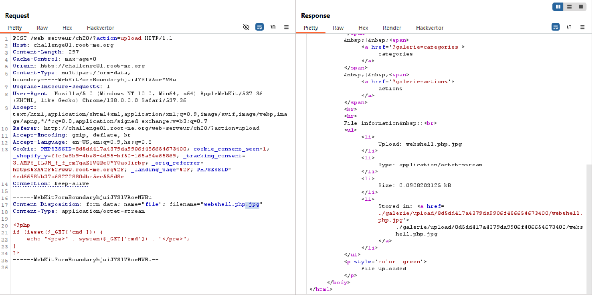
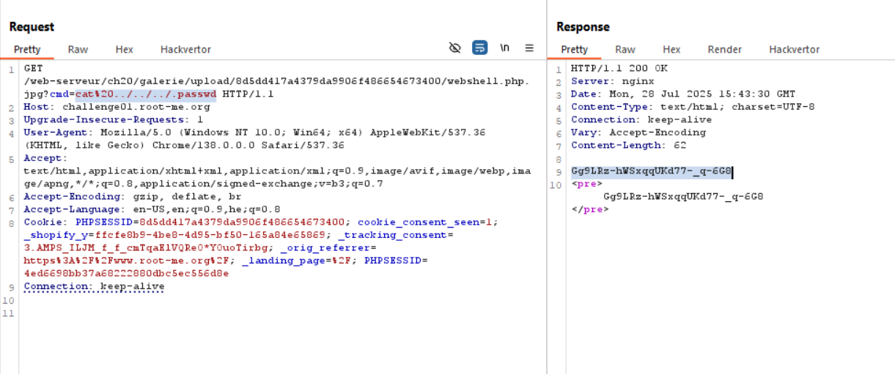

Here we try to upload our webshell.php file:
```php

```

However, we get this message: `Wrong file extension !`, so let's add manually via burp repeater the extension `.jpg`


Now, i look for `.passwd` file, just insert this payload `?cmd=ls . -la`, and then if not, move down: `?cmd=ls ../.. -la`

Last payload will be: `cat ../../../.passwd`


**Flag:** **_`Gg9LRz-hWSxqqUKd77-_q-6G8`_**
