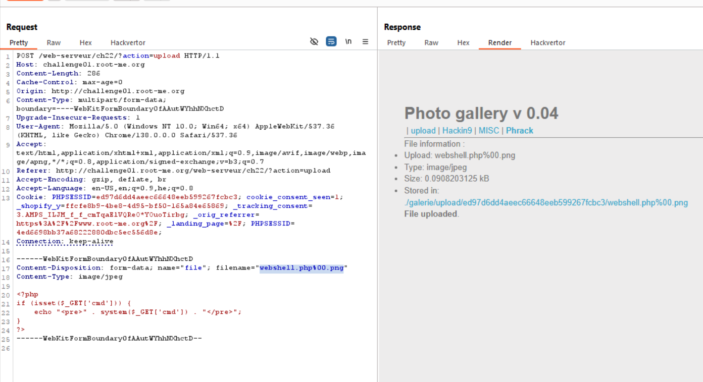

Same like [File-upload-MIME-type](./File-upload-MIME-type.md), just this time need to upload with null byte.
Here we try to upload our webshell.php file:
```php

```

However, we get this message: `Wrong file extension !`, so let's change the file from `webshell.php` to `webshell.php%00.png`, and by this way, it'll think this is a `.png` file, but when access it, i'll get `webshell.php`, because *php* is based on *C* behind the scenes, and `NULL` can be a terminator.


Now, just get this: `http://challenge01.root-me.org/web-serveur/ch22/galerie/upload/ed97d6dd4aeec66648eeb599267fcbc3/webshell.php` (you need to insert the path of the uploaded `webshell.php`)
And we get:
```
Well done ! You can validate this challenge with the password : YPNchi2NmTwygr2dgCCF
This file is already deleted.
```


**Flag:** **_`YPNchi2NmTwygr2dgCCF`_**
