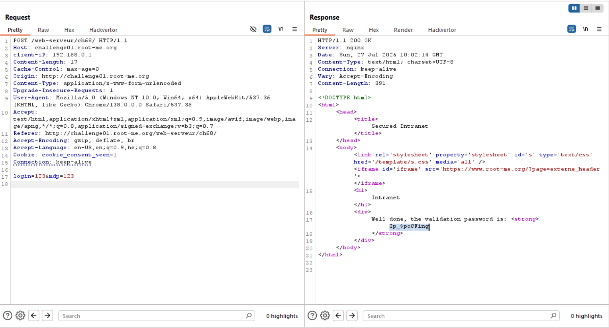

I took from here [ip spoofing via http headers](https://owasp.org/www-community/pages/attacks/ip_spoofing_via_http_headers) all the headers that might spoof my mail, and the find that `client-ip` header can spoof my mail.

Then, i looked in the RFC that was provided, and saw that `192.168.0.0/16` is the range of private IP's, so i simply sent the ip: `192.168.0.1` (default gateway i guess)

**Flag:** ***`Ip_$po0Fing`***
