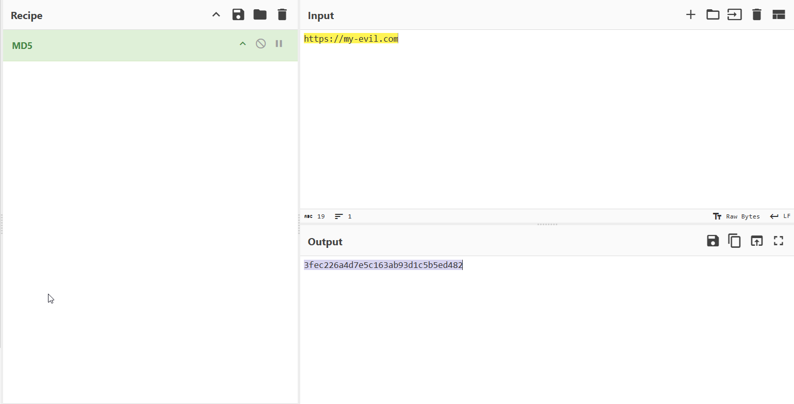
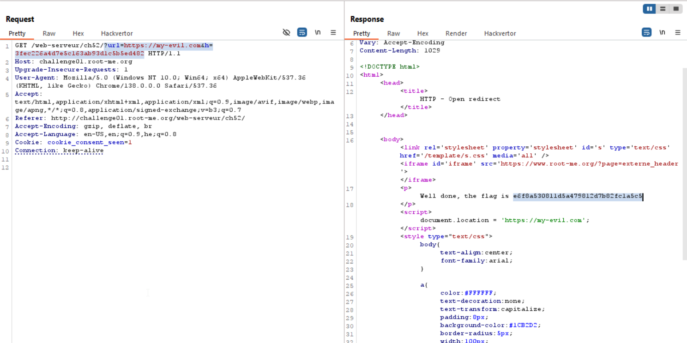

I tried to give another domain, for example `my-evil.com`, and it says wrong hash. I viewed the hash and saw this is a simple `MD5` hash, so, i simply generated my own hash:

And then, send this: `?url=https://my-evil.com&h=3fec226a4d7e5c163ab93d1c5b5ed482`

**Flag:** ***`Ip_$po0Fing`***
