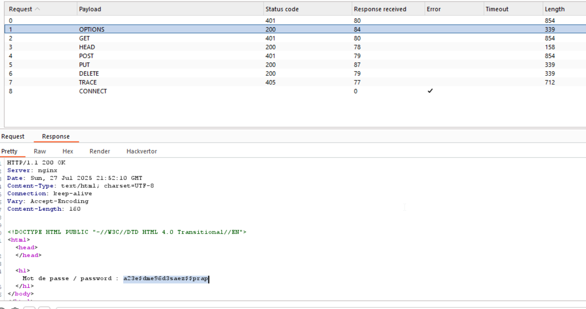

I tried using different HTTP methods, that seems to be verb-tampering, from what I read from here [OWASP HTTP Verb Tampering](https://owasp.org/www-project-web-security-testing-guide/v41/4-Web_Application_Security_Testing/07-Input_Validation_Testing/03-Testing_for_HTTP_Verb_Tampering).

So, let's use this list of http methods and try it all using burp intruder:
```
OPTIONS
GET
HEAD
POST
PUT
DELETE
TRACE
CONNECT
```

As you can see, several requests repsone with `200` and not `401`, and also contain the password.


**Flag:** **_`a23e$dme96d3saez$$prap`_**
