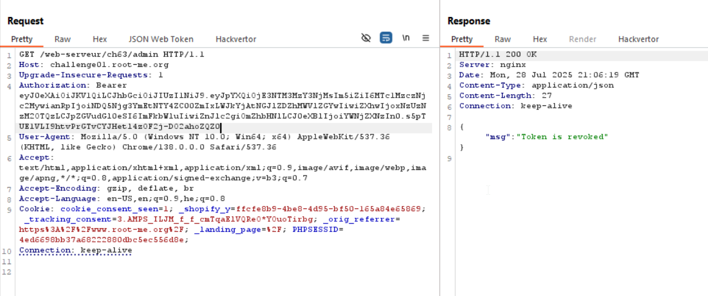
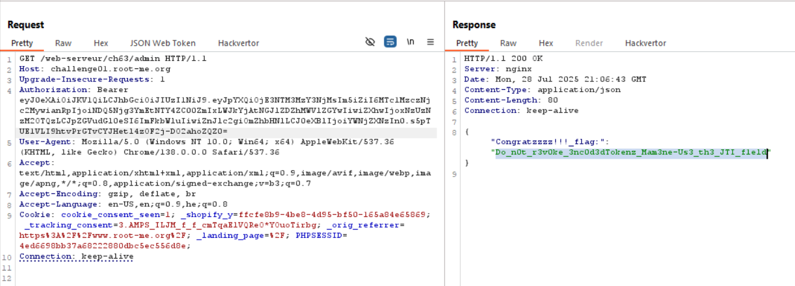

Here we get an Jwt token, and immidiattly it gets revoked, by entering the `blacklist`.

However, we want to somehow find access token which is valid, and also not in the `blacklist`.


## Base64

`Base64` is an encoding method, in which there are 64 chars
```
ABCDEFGHIJKLMNOPQRSTUVWXYZ      ← 26
abcdefghijklmnopqrstuvwxyz      ← 26
0123456789                      ← 10
+ /                             ← 2
------------------------------
Total: 64 characters
```

Okay, It takes every 3 bytes, and decode it to 4 chars. For example, given this string: `Man`:
| Character | ASCII | Binary     |
| --------- | ----- | ---------- |
| M         | 77    | `01001101` |
| a         | 97    | `01100001` |
| n         | 110   | `01101110` |

Which together is:
`01001101 01100001 01101110`

Then we split to 4 chunks:
`010011 010110 000101 101110`

| Binary | Decimal |
| ------ | ------- |
| 010011 | 19      |
| 010110 | 22      |
| 000101 | 5       |
| 101110 | 46      |

and mapping to base64 alphabet:
| Decimal | Character |
| ------- | --------- |
| 19      | T         |
| 22      | W         |
| 5       | F         |
| 46      | u         |

So the result will be `TWFu`. 

However, what happens if we get less then 3 bytes?

We padd with zeros, and then, we add `=` to each fake byte. (if we had 1 byte, we add 2 `=`, and if 2 bytes, we add 1 `=`)

| Input   | Bytes | Padding Needed | Final Base64 |
| ------- | ----- | -------------- | ------------ |
| `"H"`   | 1     | 2 `=`          | `SA==`       |
| `"Hi"`  | 2     | 1 `=`          | `SGk=`       |
| `"Man"` | 3     | 0              | `TWFu`       |

Okay, so in our case, we might be able to pad `=` at the end, and when decoding the access token we still get the same content! 
But this specific access token isn't in the `blacklist`.  




**Flag:** **_`Do_n0t_r3v0ke_3nc0d3dTokenz_Mam3ne-Us3_th3_JTI_f1eld`_**
