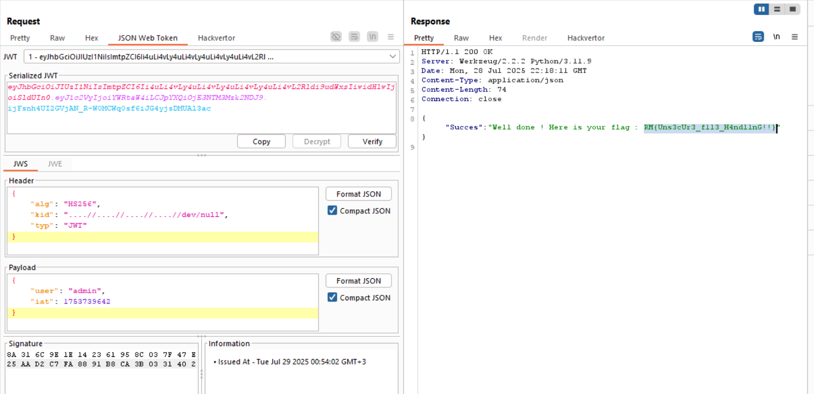

Here, we can see the `kid` parameter inside the header of the `jwk` token. 
Let's try and change it to `a` and see what we get: 
`File keys/a not found`

Okay, now we need to `path traversal`, so, let's insert `../a`,
we still get: `File keys/a not found`.

Maybe it removes all `../`, but sometimes it doesn't do this recursively, so we might can outsmart them, and give this: `....//a`
the response is: `File keys/../a not found`, it worked.

Now, I wanna inject the path to `/dev/null`, and then sign using `HS256` with the empty key, and becuase it uses this symetric key, it should work.

Remember to sign with an empty symetric key.

**Flag:** **_`RM{Uns3cUr3_f1l3_H4ndl1nG!!}`_**
