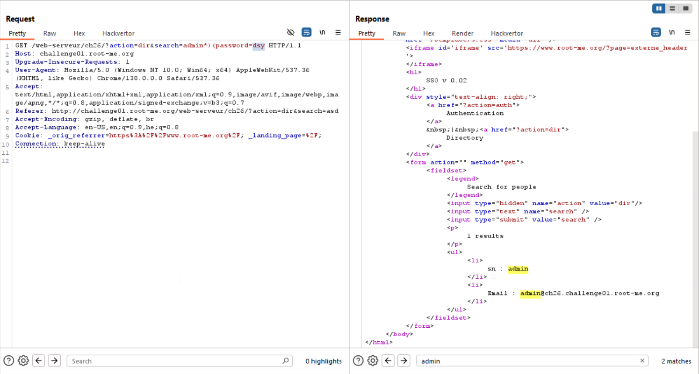
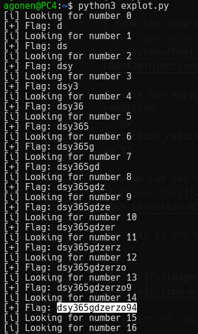

I took the code from here [payloadAllTheThings blind LDAP injection](https://github.com/swisskyrepo/PayloadsAllTheThings/tree/master/LDAP%20Injection#special-blind-ldap-injection).

This is our script, I changed the URL and the true condition.
```py

```
Here we can see the blind injection is working.
It's working because the developers added `*`, since we are using query that meant for search, and that's how it works.
We exploit this fact and add our malformed prefix, and by this way exfiltrate the password.


And this is the FLAG we achieved via the script


**Flag:** **_`dsy365gdzerzo94`_**