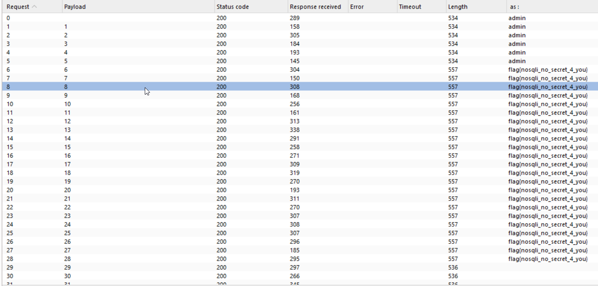

Again, I'm going to [PayloadAllTheThings NoSQL](https://swisskyrepo.github.io/PayloadsAllTheThings/NoSQL%20Injection/#authentication-bypass), here we can see this simple payload:
`login[$ne]=toto&pass[$ne]=toto`, which checks whether login isn't equal to `toto`, same as password.

Then, we get connect as an admin.

I also used this payload:
```
login[$regex]=.{1}&password[$ne]=toto
```
And ran it inside burp intruder.

The query asks: *Are there are login values which have more then x characters*. If so, it will log in because it satisfy the condition.

As you can see, after passing the value `5` (length of `admin`), we start receiving: `flag{nosqli_no_secret_4_you}`, until `28`, which is the length of `flag{nosqli_no_secret_4_you}`


**Flag:** ***`nosqli_no_secret_4_you`***
