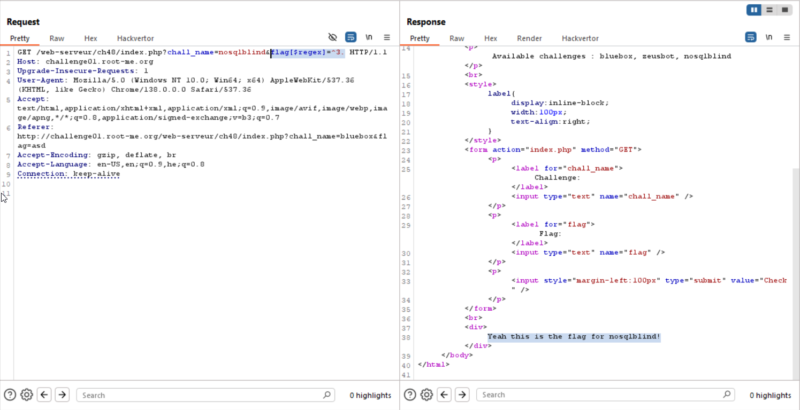
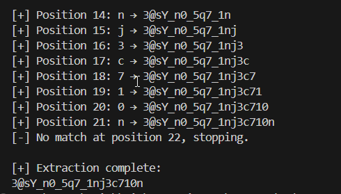

Here, very similiar to [NoSQL-injection-Authentication](./NoSQL-injection-Authentication.md), we inject some query like:
```
?chall_name=nosqlblind&flag[$regex]=^.
```
And then find the password char by char.

For example, we can see that the first character is `3`



This the script we'll use:

```py

```



**Flag:** **_`3@sY_n0_5q7_1nj3c710n`_**