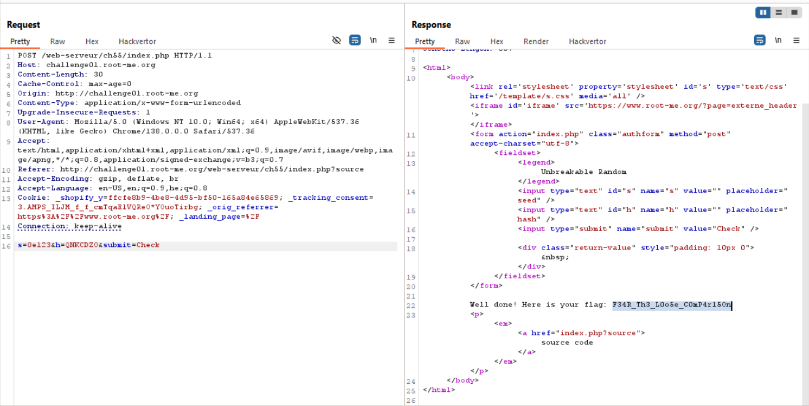

This is very similar to this challange: https://avishaigonen123.github.io/CTF_writeups/websec.fr/level10.html

Here we want to exploit the `loose comparison`, by using the scentific notation.
```php
php > $h="0e5";
php > $s="0e1"; $r=912392;
php > if ($s.$r == $h) {echo "YES";} else {echo "NO";};
YES
```

As you can see, if we manage to give some string that it's md5 is looks like: `0e4718238...(only digits)`, we will get this comparison:
`0e5.487123 == 0e3719337482434934`, which both equal to `0`.

I asked chatgpt and got this table:
| String       | MD5 Hash                           |
| ------------ | ---------------------------------- |
| `"QNKCDZO"`  | `0e830400451993494058024219903391` |
| `"aabg7XSs"` | `0e087386482136013740957780965295` |
| `"aabC9RqS"` | `0e209851980993998183831109208003` |

We we'll take `QNKCDZO`



**Flag:** ***`F34R_Th3_L0o5e_C0mP4r15On`***
