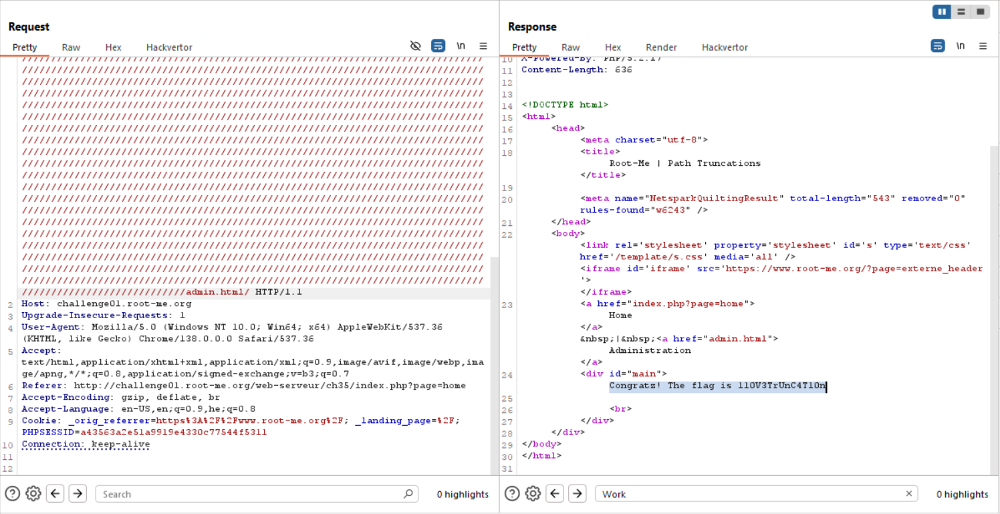

I found this paper [php file truncation php 5.3](https://jbedelsec.wordpress.com/2018/12/11/exploiting-php-file-truncation-php-5-3/).

It basiclly says this:

```
In PHP version < 5.3, string maximum length is 4096 characters. If it encounters a string longer than that it will simply truncate it, erasing any character after the maximum length. This is exactly what we want in order to escape the file extension of our LFI vulnerability !

But how to add so much caracters to our path ? We are going to use the way PHP filesystem related functions (especially include()) normalizes path. In fact, in PHP /etc/passwd/. will be interpreted as /etc/passwd by those functions, allowing us to add /. until we reach a path of 4096 characters and escape the file extention.

The idea is here, but in theory it is a bit more complicated than that, and our path have to respect the following conditions :

must start with an unknown path
must have an odd number of characters
must end with a dot
So the requested URL will more likely be as follows :

http://website.com/index.php?page=random_path/../etc/passwd/.[repeated multiples times to reach a path size of 4096 char]/.
```

In our case, I simply brute forced, until we can get something like: 
```
a/../////////home.php/
( more slashes )
```
Until we recieve `Work in progress` in response, which means it working. 
Then, we will ask for `admin.html`.

This script also retrieves the flag
```py

```



**Flag:** **_`110V3TrUnC4T10n`_**